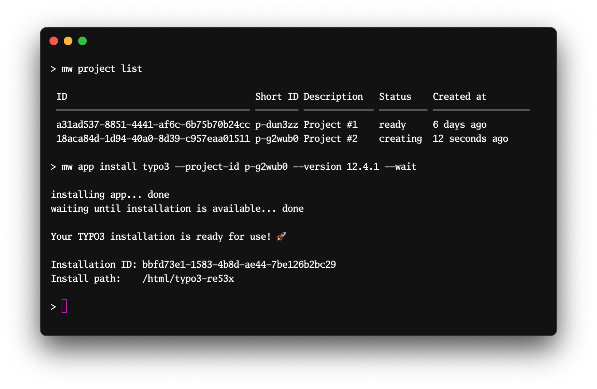

<center>

# `mw` &mdash; the mittwald command-line tool



</center>

> ⚠️ **EXPERIMENTAL &mdash; STABILITY NOTICE**
>
> This project is **experimental**, and we do not offer any stability guarantees
> of any kind for the command structure, input flags and arguments and output
> formats. We welcome you to give this project a try and we're looking forward
> for any feedback on this project in this stage of development. However, please
> do not rely on any inputs or outputs of this project to remain stable.

## Synposis

`mw` is the command-line tool for interacting with the mittwald mStudio v2 API.

## Getting started

### Installation

#### macOS, using Homebrew

Installation using [Homebrew](https://brew.sh/) is the recommended way of
installation on macOS.

```shell
$ brew tap mittwald/cli
$ brew install mw
```

#### Windows, using the Installer

Find the appropriate Windows installer from the
[releases page](https://github.com/mittwald/cli/releases) and run the installer.
After running the installer, you should be able to use the `mw` command on
either the CMD prompt or PowerShell.

#### Any OS, using Node.js+NPM

Installing the CLI via NPM will work on any OS; however we cannot guarantee
stability, because functionality of the CLI may depend on the Node.js runtime
already installed on your system. Also, the automatic upgrade will not work when
using NPM; remember to run `npm upgrade -g @mittwald/cli` occasionally.

```shell
$ npm install -g @mittwald/cli
```

#### Any OS, using Docker

There is also the
[`mittwald/cli` Docker image](https://hub.docker.com/r/mittwald/cli) that you
can use instead of installing the CLI on your system. In case of the Docker
container, authentication works a bit differently than described below: Make
sure that there is an environment variable `MITTWALD_API_TOKEN` present on your
system; you can then pass that environment variable into your container:

```shell
$ export MITTWALD_API_TOKEN=<enter token here>
$ docker run --rm -it -e MITTWALD_API_TOKEN mittwald/cli help
```

### Authentication

To use the CLI, you will need an
[mStudio API token](https://studio.mittwald.de/app/profile/api-tokens). With
your token in your clipboard, run the `mw login token` command:

```shell
$ mw login token
Enter your mStudio API token: ****************
token saved to '/Users/mhelmich/.config/mw/token'
```

### Setting up shell autocompletion

The `mw` CLI offers a lot of commands and flags, and it can be hard to remember
all of them. To make your life easier, the CLI offers autocompletion for the
Bash and ZSH shells. To enable autocompletion, run the following command:

```shell
$ mw autocomplete
```

After that, follow the instructions printed by that command (those are specific
to your shell -- Bash, ZSH and Powershell are supported).

## Contributing

If you are a developer (either at @mittwald or an external contributor) and want
to contribute to the CLI, please refer to the [CONTRIBUTING.md](CONTRIBUTING.md)
document.

## Usage

```sh-session
$ npm install -g @mittwald/cli
$ mw COMMAND
running command...
$ mw (--version)
@mittwald/cli/1.0.0 darwin-arm64 node-v18.11.0
$ mw --help [COMMAND]
USAGE
  $ mw COMMAND
...
```

## Commands

<!-- commands -->
* [`mw app copy [INSTALLATION-ID]`](#mw-app-copy-installation-id)
* [`mw app create node`](#mw-app-create-node)
* [`mw app create php`](#mw-app-create-php)
* [`mw app create python`](#mw-app-create-python)
* [`mw app create static`](#mw-app-create-static)
* [`mw app dependency list`](#mw-app-dependency-list)
* [`mw app dependency update [INSTALLATION-ID]`](#mw-app-dependency-update-installation-id)
* [`mw app dependency versions SYSTEMSOFTWARE`](#mw-app-dependency-versions-systemsoftware)
* [`mw app download [INSTALLATION-ID]`](#mw-app-download-installation-id)
* [`mw app get [INSTALLATION-ID]`](#mw-app-get-installation-id)
* [`mw app install contao`](#mw-app-install-contao)
* [`mw app install drupal`](#mw-app-install-drupal)
* [`mw app install grav`](#mw-app-install-grav)
* [`mw app install joomla`](#mw-app-install-joomla)
* [`mw app install matomo`](#mw-app-install-matomo)
* [`mw app install moodle`](#mw-app-install-moodle)
* [`mw app install neos`](#mw-app-install-neos)
* [`mw app install nextcloud`](#mw-app-install-nextcloud)
* [`mw app install prestashop`](#mw-app-install-prestashop)
* [`mw app install shopware5`](#mw-app-install-shopware5)
* [`mw app install shopware6`](#mw-app-install-shopware6)
* [`mw app install typo3`](#mw-app-install-typo3)
* [`mw app install wordpress`](#mw-app-install-wordpress)
* [`mw app list`](#mw-app-list)
* [`mw app ssh [INSTALLATION-ID]`](#mw-app-ssh-installation-id)
* [`mw app uninstall [INSTALLATION-ID]`](#mw-app-uninstall-installation-id)
* [`mw app upload [INSTALLATION-ID]`](#mw-app-upload-installation-id)
* [`mw app versions [APP]`](#mw-app-versions-app)
* [`mw autocomplete [SHELL]`](#mw-autocomplete-shell)
* [`mw backup create`](#mw-backup-create)
* [`mw backup delete BACKUP-ID`](#mw-backup-delete-backup-id)
* [`mw backup download BACKUP-ID`](#mw-backup-download-backup-id)
* [`mw backup get BACKUP-ID`](#mw-backup-get-backup-id)
* [`mw backup list`](#mw-backup-list)
* [`mw backup schedule list`](#mw-backup-schedule-list)
* [`mw context get`](#mw-context-get)
* [`mw context reset`](#mw-context-reset)
* [`mw context set`](#mw-context-set)
* [`mw conversation categories`](#mw-conversation-categories)
* [`mw conversation close ID`](#mw-conversation-close-id)
* [`mw conversation create`](#mw-conversation-create)
* [`mw conversation list`](#mw-conversation-list)
* [`mw conversation reply ID`](#mw-conversation-reply-id)
* [`mw conversation show ID`](#mw-conversation-show-id)
* [`mw conversation show2 CONVERSATIONID`](#mw-conversation-show2-conversationid)
* [`mw cronjob create`](#mw-cronjob-create)
* [`mw cronjob delete CRONJOB-ID`](#mw-cronjob-delete-cronjob-id)
* [`mw cronjob execute CRONJOB-ID`](#mw-cronjob-execute-cronjob-id)
* [`mw cronjob execution abort CRONJOB-ID EXECUTION-ID`](#mw-cronjob-execution-abort-cronjob-id-execution-id)
* [`mw cronjob execution get CRONJOB-ID EXECUTION-ID`](#mw-cronjob-execution-get-cronjob-id-execution-id)
* [`mw cronjob execution list`](#mw-cronjob-execution-list)
* [`mw cronjob execution logs CRONJOB-ID EXECUTION-ID`](#mw-cronjob-execution-logs-cronjob-id-execution-id)
* [`mw cronjob get CRONJOB-ID`](#mw-cronjob-get-cronjob-id)
* [`mw cronjob list`](#mw-cronjob-list)
* [`mw database mysql charsets`](#mw-database-mysql-charsets)
* [`mw database mysql create`](#mw-database-mysql-create)
* [`mw database mysql delete DATABASE-ID`](#mw-database-mysql-delete-database-id)
* [`mw database mysql dump DATABASE-ID`](#mw-database-mysql-dump-database-id)
* [`mw database mysql get DATABASE-ID`](#mw-database-mysql-get-database-id)
* [`mw database mysql import DATABASE-ID`](#mw-database-mysql-import-database-id)
* [`mw database mysql list`](#mw-database-mysql-list)
* [`mw database mysql phpmyadmin DATABASE-ID`](#mw-database-mysql-phpmyadmin-database-id)
* [`mw database mysql port-forward DATABASE-ID`](#mw-database-mysql-port-forward-database-id)
* [`mw database mysql shell DATABASE-ID`](#mw-database-mysql-shell-database-id)
* [`mw database mysql user delete USER-ID`](#mw-database-mysql-user-delete-user-id)
* [`mw database mysql user get ID`](#mw-database-mysql-user-get-id)
* [`mw database mysql user list`](#mw-database-mysql-user-list)
* [`mw database mysql versions`](#mw-database-mysql-versions)
* [`mw database redis create`](#mw-database-redis-create)
* [`mw database redis get ID`](#mw-database-redis-get-id)
* [`mw database redis list`](#mw-database-redis-list)
* [`mw database redis shell DATABASE-ID`](#mw-database-redis-shell-database-id)
* [`mw database redis versions`](#mw-database-redis-versions)
* [`mw ddev init [INSTALLATION-ID]`](#mw-ddev-init-installation-id)
* [`mw ddev render-config [INSTALLATION-ID]`](#mw-ddev-render-config-installation-id)
* [`mw domain dnszone get DNSZONE-ID`](#mw-domain-dnszone-get-dnszone-id)
* [`mw domain dnszone list`](#mw-domain-dnszone-list)
* [`mw domain dnszone update DNSZONE-ID RECORD-SET`](#mw-domain-dnszone-update-dnszone-id-record-set)
* [`mw domain get DOMAIN-ID`](#mw-domain-get-domain-id)
* [`mw domain list`](#mw-domain-list)
* [`mw domain virtualhost create`](#mw-domain-virtualhost-create)
* [`mw domain virtualhost delete VIRTUAL-HOST-ID`](#mw-domain-virtualhost-delete-virtual-host-id)
* [`mw domain virtualhost get INGRESS-ID`](#mw-domain-virtualhost-get-ingress-id)
* [`mw domain virtualhost list`](#mw-domain-virtualhost-list)
* [`mw help [COMMAND]`](#mw-help-command)
* [`mw login reset`](#mw-login-reset)
* [`mw login status`](#mw-login-status)
* [`mw login token`](#mw-login-token)
* [`mw mail address create`](#mw-mail-address-create)
* [`mw mail address delete ID`](#mw-mail-address-delete-id)
* [`mw mail address get ID`](#mw-mail-address-get-id)
* [`mw mail address list`](#mw-mail-address-list)
* [`mw mail address update MAILADDRESS-ID`](#mw-mail-address-update-mailaddress-id)
* [`mw mail deliverybox get ID`](#mw-mail-deliverybox-get-id)
* [`mw mail deliverybox list`](#mw-mail-deliverybox-list)
* [`mw org delete [ORG-ID]`](#mw-org-delete-org-id)
* [`mw org get [ORG-ID]`](#mw-org-get-org-id)
* [`mw org invite`](#mw-org-invite)
* [`mw org invite list`](#mw-org-invite-list)
* [`mw org invite list-own`](#mw-org-invite-list-own)
* [`mw org invite revoke INVITE-ID`](#mw-org-invite-revoke-invite-id)
* [`mw org list`](#mw-org-list)
* [`mw org membership list`](#mw-org-membership-list)
* [`mw org membership list-own`](#mw-org-membership-list-own)
* [`mw org membership revoke MEMBERSHIP-ID`](#mw-org-membership-revoke-membership-id)
* [`mw project backup create`](#mw-project-backup-create)
* [`mw project backup delete BACKUP-ID`](#mw-project-backup-delete-backup-id)
* [`mw project backup download BACKUP-ID`](#mw-project-backup-download-backup-id)
* [`mw project backup get BACKUP-ID`](#mw-project-backup-get-backup-id)
* [`mw project backup list`](#mw-project-backup-list)
* [`mw project backupschedule list`](#mw-project-backupschedule-list)
* [`mw project create`](#mw-project-create)
* [`mw project cronjob execution get CRONJOB-ID EXECUTION-ID`](#mw-project-cronjob-execution-get-cronjob-id-execution-id)
* [`mw project cronjob execution list`](#mw-project-cronjob-execution-list)
* [`mw project cronjob execution logs CRONJOB-ID EXECUTION-ID`](#mw-project-cronjob-execution-logs-cronjob-id-execution-id)
* [`mw project cronjob list`](#mw-project-cronjob-list)
* [`mw project delete [PROJECT-ID]`](#mw-project-delete-project-id)
* [`mw project filesystem usage [PROJECT-ID]`](#mw-project-filesystem-usage-project-id)
* [`mw project get [PROJECT-ID]`](#mw-project-get-project-id)
* [`mw project invite get INVITE-ID`](#mw-project-invite-get-invite-id)
* [`mw project invite list`](#mw-project-invite-list)
* [`mw project invite list-own`](#mw-project-invite-list-own)
* [`mw project list`](#mw-project-list)
* [`mw project membership get MEMBERSHIP-ID`](#mw-project-membership-get-membership-id)
* [`mw project membership get-own`](#mw-project-membership-get-own)
* [`mw project membership list`](#mw-project-membership-list)
* [`mw project membership list-own`](#mw-project-membership-list-own)
* [`mw project sftp-user list`](#mw-project-sftp-user-list)
* [`mw project ssh [PROJECT-ID]`](#mw-project-ssh-project-id)
* [`mw project ssh-user list`](#mw-project-ssh-user-list)
* [`mw project update [PROJECT-ID]`](#mw-project-update-project-id)
* [`mw server get [SERVER-ID]`](#mw-server-get-server-id)
* [`mw server list`](#mw-server-list)
* [`mw sftp-user delete SFTP-USER-ID`](#mw-sftp-user-delete-sftp-user-id)
* [`mw sftp-user list`](#mw-sftp-user-list)
* [`mw ssh-user delete SSH-USER-ID`](#mw-ssh-user-delete-ssh-user-id)
* [`mw ssh-user list`](#mw-ssh-user-list)
* [`mw update [CHANNEL]`](#mw-update-channel)
* [`mw user api-token create`](#mw-user-api-token-create)
* [`mw user api-token get TOKEN-ID`](#mw-user-api-token-get-token-id)
* [`mw user api-token list`](#mw-user-api-token-list)
* [`mw user api-token revoke ID`](#mw-user-api-token-revoke-id)
* [`mw user get USER-ID`](#mw-user-get-user-id)
* [`mw user session get TOKEN-ID`](#mw-user-session-get-token-id)
* [`mw user session list`](#mw-user-session-list)
* [`mw user ssh-key create`](#mw-user-ssh-key-create)
* [`mw user ssh-key delete ID`](#mw-user-ssh-key-delete-id)
* [`mw user ssh-key get KEY-ID`](#mw-user-ssh-key-get-key-id)
* [`mw user ssh-key import`](#mw-user-ssh-key-import)
* [`mw user ssh-key list`](#mw-user-ssh-key-list)

## `mw app copy [INSTALLATION-ID]`

Copy an app within a project

```
USAGE
  $ mw app copy [INSTALLATION-ID] --description <value> [-q]

ARGUMENTS
  INSTALLATION-ID  ID or short ID of an app installation; this argument is optional if a default app installation is set
                   in the context

FLAGS
  -q, --quiet                suppress process output and only display a machine-readable summary.
      --description=<value>  (required) set a description for the new app installation

DESCRIPTION
  Copy an app within a project

FLAG DESCRIPTIONS
  -q, --quiet  suppress process output and only display a machine-readable summary.

    This flag controls if you want to see the process output or only a summary. When using mw non-interactively (e.g. in
    scripts), you can use this flag to easily get the IDs of created resources for further processing.
```

## `mw app create node`

Creates new custom Node.js installation.

```
USAGE
  $ mw app create node [-p <value>] [-q] [--site-title <value>] [-w] [--entrypoint <value>]

FLAGS
  -p, --project-id=<value>  ID or short ID of a project; this flag is optional if a default project is set in the
                            context
  -q, --quiet               suppress process output and only display a machine-readable summary.
  -w, --wait                wait for your custom Node.js to be ready.
      --entrypoint=<value>  [default: yarn start] the command that should be used to start your custom Node.js
                            application.
      --site-title=<value>  site title for your custom Node.js installation.

DESCRIPTION
  Creates new custom Node.js installation.

FLAG DESCRIPTIONS
  -p, --project-id=<value>  ID or short ID of a project; this flag is optional if a default project is set in the context

    May contain a short ID or a full ID of a project; you can also use the "mw context set --project-id=<VALUE>" command
    to persistently set a default project for all commands that accept this flag.

  -q, --quiet  suppress process output and only display a machine-readable summary.

    This flag controls if you want to see the process output or only a summary. When using mw non-interactively (e.g. in
    scripts), you can use this flag to easily get the IDs of created resources for further processing.

  --entrypoint=<value>  the command that should be used to start your custom Node.js application.

    This is the command that should be used to start your application; the app is required to run in the foreground, and
    to listen on the port specified by the PORT environment variable.

  --site-title=<value>  site title for your custom Node.js installation.

    The site title for this custom Node.js installation. It is also the title shown in the app overview in the mStudio
    and the CLI.
    If unspecified, the application name and the given project ID will be used. The title can be changed after the
    installation is finished
```

## `mw app create php`

Creates new custom PHP installation.

```
USAGE
  $ mw app create php --document-root <value> [-p <value>] [-q] [--site-title <value>] [-w]

FLAGS
  -p, --project-id=<value>     ID or short ID of a project; this flag is optional if a default project is set in the
                               context
  -q, --quiet                  suppress process output and only display a machine-readable summary.
  -w, --wait                   wait for your custom PHP to be ready.
      --document-root=<value>  (required) [default: /] the document root from which your custom PHP will be served
                               (relative to the installation path)
      --site-title=<value>     site title for your custom PHP installation.

DESCRIPTION
  Creates new custom PHP installation.

FLAG DESCRIPTIONS
  -p, --project-id=<value>  ID or short ID of a project; this flag is optional if a default project is set in the context

    May contain a short ID or a full ID of a project; you can also use the "mw context set --project-id=<VALUE>" command
    to persistently set a default project for all commands that accept this flag.

  -q, --quiet  suppress process output and only display a machine-readable summary.

    This flag controls if you want to see the process output or only a summary. When using mw non-interactively (e.g. in
    scripts), you can use this flag to easily get the IDs of created resources for further processing.

  --document-root=<value>

    the document root from which your custom PHP will be served (relative to the installation path)

    This is the document root from which the files of your application will be served by the web server. This directory
    is specified relative to the installation path.

  --site-title=<value>  site title for your custom PHP installation.

    The site title for this custom PHP installation. It is also the title shown in the app overview in the mStudio and
    the CLI.
    If unspecified, the application name and the given project ID will be used. The title can be changed after the
    installation is finished
```

## `mw app create python`

Creates new custom python site installation.

```
USAGE
  $ mw app create python --document-root <value> [-p <value>] [-q] [--site-title <value>] [-w]

FLAGS
  -p, --project-id=<value>     ID or short ID of a project; this flag is optional if a default project is set in the
                               context
  -q, --quiet                  suppress process output and only display a machine-readable summary.
  -w, --wait                   wait for your custom python site to be ready.
      --document-root=<value>  (required) [default: /] the document root from which your custom python site will be
                               served (relative to the installation path)
      --site-title=<value>     site title for your custom python site installation.

DESCRIPTION
  Creates new custom python site installation.

FLAG DESCRIPTIONS
  -p, --project-id=<value>  ID or short ID of a project; this flag is optional if a default project is set in the context

    May contain a short ID or a full ID of a project; you can also use the "mw context set --project-id=<VALUE>" command
    to persistently set a default project for all commands that accept this flag.

  -q, --quiet  suppress process output and only display a machine-readable summary.

    This flag controls if you want to see the process output or only a summary. When using mw non-interactively (e.g. in
    scripts), you can use this flag to easily get the IDs of created resources for further processing.

  --document-root=<value>

    the document root from which your custom python site will be served (relative to the installation path)

    This is the document root from which the files of your application will be served by the web server. This directory
    is specified relative to the installation path.

  --site-title=<value>  site title for your custom python site installation.

    The site title for this custom python site installation. It is also the title shown in the app overview in the
    mStudio and the CLI.
    If unspecified, the application name and the given project ID will be used. The title can be changed after the
    installation is finished
```

## `mw app create static`

Creates new custom static site installation.

```
USAGE
  $ mw app create static --document-root <value> [-p <value>] [-q] [--site-title <value>] [-w]

FLAGS
  -p, --project-id=<value>     ID or short ID of a project; this flag is optional if a default project is set in the
                               context
  -q, --quiet                  suppress process output and only display a machine-readable summary.
  -w, --wait                   wait for your custom static site to be ready.
      --document-root=<value>  (required) [default: /] the document root from which your custom static site will be
                               served (relative to the installation path)
      --site-title=<value>     site title for your custom static site installation.

DESCRIPTION
  Creates new custom static site installation.

FLAG DESCRIPTIONS
  -p, --project-id=<value>  ID or short ID of a project; this flag is optional if a default project is set in the context

    May contain a short ID or a full ID of a project; you can also use the "mw context set --project-id=<VALUE>" command
    to persistently set a default project for all commands that accept this flag.

  -q, --quiet  suppress process output and only display a machine-readable summary.

    This flag controls if you want to see the process output or only a summary. When using mw non-interactively (e.g. in
    scripts), you can use this flag to easily get the IDs of created resources for further processing.

  --document-root=<value>

    the document root from which your custom static site will be served (relative to the installation path)

    This is the document root from which the files of your application will be served by the web server. This directory
    is specified relative to the installation path.

  --site-title=<value>  site title for your custom static site installation.

    The site title for this custom static site installation. It is also the title shown in the app overview in the
    mStudio and the CLI.
    If unspecified, the application name and the given project ID will be used. The title can be changed after the
    installation is finished
```

## `mw app dependency list`

Get all available dependencies

```
USAGE
  $ mw app dependency list [--columns <value> | -x] [--no-header | [--csv | --no-truncate]] [-o txt|json|yaml|csv |  | ]
    [--no-relative-dates]

FLAGS
  -o, --output=<option>    [default: txt] output in a more machine friendly format
                           <options: txt|json|yaml|csv>
  -x, --extended           show extra columns
      --columns=<value>    only show provided columns (comma-separated)
      --csv                output is csv format [alias: --output=csv]
      --no-header          hide table header from output
      --no-relative-dates  show dates in absolute format, not relative
      --no-truncate        do not truncate output to fit screen

DESCRIPTION
  Get all available dependencies
```

## `mw app dependency update [INSTALLATION-ID]`

Update the dependencies of an app

```
USAGE
  $ mw app dependency update [INSTALLATION-ID] --set <value> [-q] [--update-policy none|inheritedFromApp|patchLevel|all]

ARGUMENTS
  INSTALLATION-ID  ID or short ID of an app installation; this argument is optional if a default app installation is set
                   in the context

FLAGS
  -q, --quiet                   suppress process output and only display a machine-readable summary.
      --set=<value>...          (required) set a dependency to a specific version
      --update-policy=<option>  [default: patchLevel] set the update policy for the configured dependencies
                                <options: none|inheritedFromApp|patchLevel|all>

EXAMPLES
  Update Node.js version to newest available from the 18.x branch

    $ mw app dependency update $APP_ID --set node=~18

FLAG DESCRIPTIONS
  -q, --quiet  suppress process output and only display a machine-readable summary.

    This flag controls if you want to see the process output or only a summary. When using mw non-interactively (e.g. in
    scripts), you can use this flag to easily get the IDs of created resources for further processing.

  --set=<value>...  set a dependency to a specific version

    The format is <dependency>=<version>, where <dependency> is the name of the dependency (use the "mw app dependency
    list" command to get a list of available dependencies) and <version> is a semver constraint.

    This flag may be specified multiple times to update multiple dependencies.
```

## `mw app dependency versions SYSTEMSOFTWARE`

Get all available versions of a particular dependency

```
USAGE
  $ mw app dependency versions SYSTEMSOFTWARE [--columns <value> | -x] [--no-header | [--csv | --no-truncate]] [-o
    txt|json|yaml|csv |  | ] [--no-relative-dates]

ARGUMENTS
  SYSTEMSOFTWARE  name of the systemsoftware for which to list versions

FLAGS
  -o, --output=<option>    [default: txt] output in a more machine friendly format
                           <options: txt|json|yaml|csv>
  -x, --extended           show extra columns
      --columns=<value>    only show provided columns (comma-separated)
      --csv                output is csv format [alias: --output=csv]
      --no-header          hide table header from output
      --no-relative-dates  show dates in absolute format, not relative
      --no-truncate        do not truncate output to fit screen

DESCRIPTION
  Get all available versions of a particular dependency
```

## `mw app download [INSTALLATION-ID]`

Download the filesystem of an app within a project to your local machine

```
USAGE
  $ mw app download [INSTALLATION-ID] --target <value> [-q] [--ssh-user <value>] [--dry-run] [--delete]

ARGUMENTS
  INSTALLATION-ID  ID or short ID of an app installation; this argument is optional if a default app installation is set
                   in the context

FLAGS
  -q, --quiet             suppress process output and only display a machine-readable summary.
      --delete            delete local files that are not present on the server
      --dry-run           do not actually download the app installation
      --ssh-user=<value>  override the SSH user to connect with; if omitted, your own user will be used
      --target=<value>    (required) target directory to download the app installation to

DESCRIPTION
  Download the filesystem of an app within a project to your local machine

FLAG DESCRIPTIONS
  -q, --quiet  suppress process output and only display a machine-readable summary.

    This flag controls if you want to see the process output or only a summary. When using mw non-interactively (e.g. in
    scripts), you can use this flag to easily get the IDs of created resources for further processing.

  --ssh-user=<value>  override the SSH user to connect with; if omitted, your own user will be used

    This flag can be used to override the SSH user that is used for a connection; be default, your own personal user
    will be used for this.

    You can also set this value by setting the MITTWALD_SSH_USER environment variable.
```

## `mw app get [INSTALLATION-ID]`

Get details about an app installation

```
USAGE
  $ mw app get [INSTALLATION-ID] [-o json|yaml |  | ]

ARGUMENTS
  INSTALLATION-ID  ID or short ID of an app installation; this argument is optional if a default app installation is set
                   in the context

FLAGS
  -o, --output=<option>  output in a more machine friendly format
                         <options: json|yaml>

DESCRIPTION
  Get details about an app installation
```

## `mw app install contao`

Creates new Contao installation.

```
USAGE
  $ mw app install contao --version <value> [-p <value>] [-q] [--host <value>] [--admin-firstname <value>] [--admin-user
    <value>] [--admin-email <value>] [--admin-pass <value>] [--admin-lastname <value>] [--site-title <value>] [-w]

FLAGS
  -p, --project-id=<value>       ID or short ID of a project; this flag is optional if a default project is set in the
                                 context
  -q, --quiet                    suppress process output and only display a machine-readable summary.
  -w, --wait                     wait for your Contao to be ready.
      --admin-email=<value>      email address of your administrator user.
      --admin-firstname=<value>  first name of your administrator user.
      --admin-lastname=<value>   Lastname of your administrator user.
      --admin-pass=<value>       password of your administrator user.
      --admin-user=<value>       Username for your administrator user.
      --host=<value>             host to initially configure your Contao installation with; needs to be created
                                 separately.
      --site-title=<value>       site title for your Contao installation.
      --version=<value>          (required) [default: latest] version of Contao to be installed.

DESCRIPTION
  Creates new Contao installation.

FLAG DESCRIPTIONS
  -p, --project-id=<value>  ID or short ID of a project; this flag is optional if a default project is set in the context

    May contain a short ID or a full ID of a project; you can also use the "mw context set --project-id=<VALUE>" command
    to persistently set a default project for all commands that accept this flag.

  -q, --quiet  suppress process output and only display a machine-readable summary.

    This flag controls if you want to see the process output or only a summary. When using mw non-interactively (e.g. in
    scripts), you can use this flag to easily get the IDs of created resources for further processing.

  --admin-email=<value>  email address of your administrator user.

    email address that will be used for the first administrator user that is created during the Contao installation.
    If unspecified, email address of your mStudio account will be used. This email address can be changed after the
    installation is finished.

  --admin-firstname=<value>  first name of your administrator user.

    The first name that will be used for the first administrator user that is created during the Contao installation.
    If unspecified, the first name of your mStudio user will be used. This value can be changed after the installation
    is finished.

  --admin-lastname=<value>  Lastname of your administrator user.

    The last name that will be used for the first administrator user that is created during the Contao installation.
    If unspecified, the last name of your mStudio user will be used. This value can be changed after the installation is
    finished.

  --admin-pass=<value>  password of your administrator user.

    The password that will be used for the first administrator user that is created during the Contao installation.
    If unspecified, a random secure password will be generated and printed to stdout. This password can be changed after
    the installation is finished

  --admin-user=<value>  Username for your administrator user.

    Username of the first administrator user which will be created during the Contao installation.
    If unspecified, an adequate username will be generated.
    After the installation is finished, the username can be changed and additional administrator users can be created.

  --host=<value>  host to initially configure your Contao installation with; needs to be created separately.

    Specify a host which will be used during the installation and as an initial host for the Contao configuration.
    If unspecified, the default host for the given project will be used.
    This does not change the target of the used host and can be changed later by configuring the host and your Contao
    installation.

  --site-title=<value>  site title for your Contao installation.

    The site title for this Contao installation. It is also the title shown in the app overview in the mStudio and the
    CLI.
    If unspecified, the application name and the given project ID will be used. The title can be changed after the
    installation is finished

  --version=<value>  version of Contao to be installed.

    Specify the version in which your Contao will be installed.
    If unspecified, the Contao will be installed in the latest available version.
```

## `mw app install drupal`

Creates new Drupal installation.

```
USAGE
  $ mw app install drupal --version <value> [-p <value>] [-q] [--host <value>] [--admin-user <value>] [--admin-email
    <value>] [--admin-pass <value>] [--site-title <value>] [-w]

FLAGS
  -p, --project-id=<value>   ID or short ID of a project; this flag is optional if a default project is set in the
                             context
  -q, --quiet                suppress process output and only display a machine-readable summary.
  -w, --wait                 wait for your Drupal to be ready.
      --admin-email=<value>  email address of your administrator user.
      --admin-pass=<value>   password of your administrator user.
      --admin-user=<value>   Username for your administrator user.
      --host=<value>         host to initially configure your Drupal installation with; needs to be created separately.
      --site-title=<value>   site title for your Drupal installation.
      --version=<value>      (required) [default: latest] version of Drupal to be installed.

DESCRIPTION
  Creates new Drupal installation.

FLAG DESCRIPTIONS
  -p, --project-id=<value>  ID or short ID of a project; this flag is optional if a default project is set in the context

    May contain a short ID or a full ID of a project; you can also use the "mw context set --project-id=<VALUE>" command
    to persistently set a default project for all commands that accept this flag.

  -q, --quiet  suppress process output and only display a machine-readable summary.

    This flag controls if you want to see the process output or only a summary. When using mw non-interactively (e.g. in
    scripts), you can use this flag to easily get the IDs of created resources for further processing.

  --admin-email=<value>  email address of your administrator user.

    email address that will be used for the first administrator user that is created during the Drupal installation.
    If unspecified, email address of your mStudio account will be used. This email address can be changed after the
    installation is finished.

  --admin-pass=<value>  password of your administrator user.

    The password that will be used for the first administrator user that is created during the Drupal installation.
    If unspecified, a random secure password will be generated and printed to stdout. This password can be changed after
    the installation is finished

  --admin-user=<value>  Username for your administrator user.

    Username of the first administrator user which will be created during the Drupal installation.
    If unspecified, an adequate username will be generated.
    After the installation is finished, the username can be changed and additional administrator users can be created.

  --host=<value>  host to initially configure your Drupal installation with; needs to be created separately.

    Specify a host which will be used during the installation and as an initial host for the Drupal configuration.
    If unspecified, the default host for the given project will be used.
    This does not change the target of the used host and can be changed later by configuring the host and your Drupal
    installation.

  --site-title=<value>  site title for your Drupal installation.

    The site title for this Drupal installation. It is also the title shown in the app overview in the mStudio and the
    CLI.
    If unspecified, the application name and the given project ID will be used. The title can be changed after the
    installation is finished

  --version=<value>  version of Drupal to be installed.

    Specify the version in which your Drupal will be installed.
    If unspecified, the Drupal will be installed in the latest available version.
```

## `mw app install grav`

Creates new Grav installation.

```
USAGE
  $ mw app install grav --version <value> [-p <value>] [-q] [--admin-user <value>] [--admin-email <value>]
    [--admin-pass <value>] [--admin-firstname <value>] [--admin-lastname <value>] [--site-title <value>] [-w]

FLAGS
  -p, --project-id=<value>       ID or short ID of a project; this flag is optional if a default project is set in the
                                 context
  -q, --quiet                    suppress process output and only display a machine-readable summary.
  -w, --wait                     wait for your Grav to be ready.
      --admin-email=<value>      email address of your administrator user.
      --admin-firstname=<value>  first name of your administrator user.
      --admin-lastname=<value>   Lastname of your administrator user.
      --admin-pass=<value>       password of your administrator user.
      --admin-user=<value>       Username for your administrator user.
      --site-title=<value>       site title for your Grav installation.
      --version=<value>          (required) [default: latest] version of Grav to be installed.

DESCRIPTION
  Creates new Grav installation.

FLAG DESCRIPTIONS
  -p, --project-id=<value>  ID or short ID of a project; this flag is optional if a default project is set in the context

    May contain a short ID or a full ID of a project; you can also use the "mw context set --project-id=<VALUE>" command
    to persistently set a default project for all commands that accept this flag.

  -q, --quiet  suppress process output and only display a machine-readable summary.

    This flag controls if you want to see the process output or only a summary. When using mw non-interactively (e.g. in
    scripts), you can use this flag to easily get the IDs of created resources for further processing.

  --admin-email=<value>  email address of your administrator user.

    email address that will be used for the first administrator user that is created during the Grav installation.
    If unspecified, email address of your mStudio account will be used. This email address can be changed after the
    installation is finished.

  --admin-firstname=<value>  first name of your administrator user.

    The first name that will be used for the first administrator user that is created during the Grav installation.
    If unspecified, the first name of your mStudio user will be used. This value can be changed after the installation
    is finished.

  --admin-lastname=<value>  Lastname of your administrator user.

    The last name that will be used for the first administrator user that is created during the Grav installation.
    If unspecified, the last name of your mStudio user will be used. This value can be changed after the installation is
    finished.

  --admin-pass=<value>  password of your administrator user.

    The password that will be used for the first administrator user that is created during the Grav installation.
    If unspecified, a random secure password will be generated and printed to stdout. This password can be changed after
    the installation is finished

  --admin-user=<value>  Username for your administrator user.

    Username of the first administrator user which will be created during the Grav installation.
    If unspecified, an adequate username will be generated.
    After the installation is finished, the username can be changed and additional administrator users can be created.

  --site-title=<value>  site title for your Grav installation.

    The site title for this Grav installation. It is also the title shown in the app overview in the mStudio and the
    CLI.
    If unspecified, the application name and the given project ID will be used. The title can be changed after the
    installation is finished

  --version=<value>  version of Grav to be installed.

    Specify the version in which your Grav will be installed.
    If unspecified, the Grav will be installed in the latest available version.
```

## `mw app install joomla`

Creates new Joomla! installation.

```
USAGE
  $ mw app install joomla --version <value> [-p <value>] [-q] [--host <value>] [--admin-user <value>] [--admin-email
    <value>] [--admin-pass <value>] [--admin-firstname <value>] [--admin-lastname <value>] [--site-title <value>] [-w]

FLAGS
  -p, --project-id=<value>       ID or short ID of a project; this flag is optional if a default project is set in the
                                 context
  -q, --quiet                    suppress process output and only display a machine-readable summary.
  -w, --wait                     wait for your Joomla! to be ready.
      --admin-email=<value>      email address of your administrator user.
      --admin-firstname=<value>  first name of your administrator user.
      --admin-lastname=<value>   Lastname of your administrator user.
      --admin-pass=<value>       password of your administrator user.
      --admin-user=<value>       Username for your administrator user.
      --host=<value>             host to initially configure your Joomla! installation with; needs to be created
                                 separately.
      --site-title=<value>       site title for your Joomla! installation.
      --version=<value>          (required) [default: latest] version of Joomla! to be installed.

DESCRIPTION
  Creates new Joomla! installation.

FLAG DESCRIPTIONS
  -p, --project-id=<value>  ID or short ID of a project; this flag is optional if a default project is set in the context

    May contain a short ID or a full ID of a project; you can also use the "mw context set --project-id=<VALUE>" command
    to persistently set a default project for all commands that accept this flag.

  -q, --quiet  suppress process output and only display a machine-readable summary.

    This flag controls if you want to see the process output or only a summary. When using mw non-interactively (e.g. in
    scripts), you can use this flag to easily get the IDs of created resources for further processing.

  --admin-email=<value>  email address of your administrator user.

    email address that will be used for the first administrator user that is created during the Joomla! installation.
    If unspecified, email address of your mStudio account will be used. This email address can be changed after the
    installation is finished.

  --admin-firstname=<value>  first name of your administrator user.

    The first name that will be used for the first administrator user that is created during the Joomla! installation.
    If unspecified, the first name of your mStudio user will be used. This value can be changed after the installation
    is finished.

  --admin-lastname=<value>  Lastname of your administrator user.

    The last name that will be used for the first administrator user that is created during the Joomla! installation.
    If unspecified, the last name of your mStudio user will be used. This value can be changed after the installation is
    finished.

  --admin-pass=<value>  password of your administrator user.

    The password that will be used for the first administrator user that is created during the Joomla! installation.
    If unspecified, a random secure password will be generated and printed to stdout. This password can be changed after
    the installation is finished

  --admin-user=<value>  Username for your administrator user.

    Username of the first administrator user which will be created during the Joomla! installation.
    If unspecified, an adequate username will be generated.
    After the installation is finished, the username can be changed and additional administrator users can be created.

  --host=<value>  host to initially configure your Joomla! installation with; needs to be created separately.

    Specify a host which will be used during the installation and as an initial host for the Joomla! configuration.
    If unspecified, the default host for the given project will be used.
    This does not change the target of the used host and can be changed later by configuring the host and your Joomla!
    installation.

  --site-title=<value>  site title for your Joomla! installation.

    The site title for this Joomla! installation. It is also the title shown in the app overview in the mStudio and the
    CLI.
    If unspecified, the application name and the given project ID will be used. The title can be changed after the
    installation is finished

  --version=<value>  version of Joomla! to be installed.

    Specify the version in which your Joomla! will be installed.
    If unspecified, the Joomla! will be installed in the latest available version.
```

## `mw app install matomo`

Creates new Matomo installation.

```
USAGE
  $ mw app install matomo --version <value> [-p <value>] [-q] [--host <value>] [--admin-user <value>] [--admin-email
    <value>] [--admin-pass <value>] [--site-title <value>] [-w]

FLAGS
  -p, --project-id=<value>   ID or short ID of a project; this flag is optional if a default project is set in the
                             context
  -q, --quiet                suppress process output and only display a machine-readable summary.
  -w, --wait                 wait for your Matomo to be ready.
      --admin-email=<value>  email address of your administrator user.
      --admin-pass=<value>   password of your administrator user.
      --admin-user=<value>   Username for your administrator user.
      --host=<value>         host to initially configure your Matomo installation with; needs to be created separately.
      --site-title=<value>   site title for your Matomo installation.
      --version=<value>      (required) [default: latest] version of Matomo to be installed.

DESCRIPTION
  Creates new Matomo installation.

FLAG DESCRIPTIONS
  -p, --project-id=<value>  ID or short ID of a project; this flag is optional if a default project is set in the context

    May contain a short ID or a full ID of a project; you can also use the "mw context set --project-id=<VALUE>" command
    to persistently set a default project for all commands that accept this flag.

  -q, --quiet  suppress process output and only display a machine-readable summary.

    This flag controls if you want to see the process output or only a summary. When using mw non-interactively (e.g. in
    scripts), you can use this flag to easily get the IDs of created resources for further processing.

  --admin-email=<value>  email address of your administrator user.

    email address that will be used for the first administrator user that is created during the Matomo installation.
    If unspecified, email address of your mStudio account will be used. This email address can be changed after the
    installation is finished.

  --admin-pass=<value>  password of your administrator user.

    The password that will be used for the first administrator user that is created during the Matomo installation.
    If unspecified, a random secure password will be generated and printed to stdout. This password can be changed after
    the installation is finished

  --admin-user=<value>  Username for your administrator user.

    Username of the first administrator user which will be created during the Matomo installation.
    If unspecified, an adequate username will be generated.
    After the installation is finished, the username can be changed and additional administrator users can be created.

  --host=<value>  host to initially configure your Matomo installation with; needs to be created separately.

    Specify a host which will be used during the installation and as an initial host for the Matomo configuration.
    If unspecified, the default host for the given project will be used.
    This does not change the target of the used host and can be changed later by configuring the host and your Matomo
    installation.

  --site-title=<value>  site title for your Matomo installation.

    The site title for this Matomo installation. It is also the title shown in the app overview in the mStudio and the
    CLI.
    If unspecified, the application name and the given project ID will be used. The title can be changed after the
    installation is finished

  --version=<value>  version of Matomo to be installed.

    Specify the version in which your Matomo will be installed.
    If unspecified, the Matomo will be installed in the latest available version.
```

## `mw app install moodle`

Creates new Moodle installation.

```
USAGE
  $ mw app install moodle --version <value> [-p <value>] [-q] [--host <value>] [--admin-user <value>] [--admin-email
    <value>] [--admin-pass <value>] [--site-title <value>] [-w]

FLAGS
  -p, --project-id=<value>   ID or short ID of a project; this flag is optional if a default project is set in the
                             context
  -q, --quiet                suppress process output and only display a machine-readable summary.
  -w, --wait                 wait for your Moodle to be ready.
      --admin-email=<value>  email address of your administrator user.
      --admin-pass=<value>   password of your administrator user.
      --admin-user=<value>   Username for your administrator user.
      --host=<value>         host to initially configure your Moodle installation with; needs to be created separately.
      --site-title=<value>   site title for your Moodle installation.
      --version=<value>      (required) [default: latest] version of Moodle to be installed.

DESCRIPTION
  Creates new Moodle installation.

FLAG DESCRIPTIONS
  -p, --project-id=<value>  ID or short ID of a project; this flag is optional if a default project is set in the context

    May contain a short ID or a full ID of a project; you can also use the "mw context set --project-id=<VALUE>" command
    to persistently set a default project for all commands that accept this flag.

  -q, --quiet  suppress process output and only display a machine-readable summary.

    This flag controls if you want to see the process output or only a summary. When using mw non-interactively (e.g. in
    scripts), you can use this flag to easily get the IDs of created resources for further processing.

  --admin-email=<value>  email address of your administrator user.

    email address that will be used for the first administrator user that is created during the Moodle installation.
    If unspecified, email address of your mStudio account will be used. This email address can be changed after the
    installation is finished.

  --admin-pass=<value>  password of your administrator user.

    The password that will be used for the first administrator user that is created during the Moodle installation.
    If unspecified, a random secure password will be generated and printed to stdout. This password can be changed after
    the installation is finished

  --admin-user=<value>  Username for your administrator user.

    Username of the first administrator user which will be created during the Moodle installation.
    If unspecified, an adequate username will be generated.
    After the installation is finished, the username can be changed and additional administrator users can be created.

  --host=<value>  host to initially configure your Moodle installation with; needs to be created separately.

    Specify a host which will be used during the installation and as an initial host for the Moodle configuration.
    If unspecified, the default host for the given project will be used.
    This does not change the target of the used host and can be changed later by configuring the host and your Moodle
    installation.

  --site-title=<value>  site title for your Moodle installation.

    The site title for this Moodle installation. It is also the title shown in the app overview in the mStudio and the
    CLI.
    If unspecified, the application name and the given project ID will be used. The title can be changed after the
    installation is finished

  --version=<value>  version of Moodle to be installed.

    Specify the version in which your Moodle will be installed.
    If unspecified, the Moodle will be installed in the latest available version.
```

## `mw app install neos`

Creates new NEOS installation.

```
USAGE
  $ mw app install neos --version <value> [-p <value>] [-q] [--admin-user <value>] [--admin-pass <value>]
    [--admin-firstname <value>] [--admin-lastname <value>] [--site-title <value>] [-w]

FLAGS
  -p, --project-id=<value>       ID or short ID of a project; this flag is optional if a default project is set in the
                                 context
  -q, --quiet                    suppress process output and only display a machine-readable summary.
  -w, --wait                     wait for your NEOS to be ready.
      --admin-firstname=<value>  first name of your administrator user.
      --admin-lastname=<value>   Lastname of your administrator user.
      --admin-pass=<value>       password of your administrator user.
      --admin-user=<value>       Username for your administrator user.
      --site-title=<value>       site title for your NEOS installation.
      --version=<value>          (required) [default: latest] version of NEOS to be installed.

DESCRIPTION
  Creates new NEOS installation.

FLAG DESCRIPTIONS
  -p, --project-id=<value>  ID or short ID of a project; this flag is optional if a default project is set in the context

    May contain a short ID or a full ID of a project; you can also use the "mw context set --project-id=<VALUE>" command
    to persistently set a default project for all commands that accept this flag.

  -q, --quiet  suppress process output and only display a machine-readable summary.

    This flag controls if you want to see the process output or only a summary. When using mw non-interactively (e.g. in
    scripts), you can use this flag to easily get the IDs of created resources for further processing.

  --admin-firstname=<value>  first name of your administrator user.

    The first name that will be used for the first administrator user that is created during the NEOS installation.
    If unspecified, the first name of your mStudio user will be used. This value can be changed after the installation
    is finished.

  --admin-lastname=<value>  Lastname of your administrator user.

    The last name that will be used for the first administrator user that is created during the NEOS installation.
    If unspecified, the last name of your mStudio user will be used. This value can be changed after the installation is
    finished.

  --admin-pass=<value>  password of your administrator user.

    The password that will be used for the first administrator user that is created during the NEOS installation.
    If unspecified, a random secure password will be generated and printed to stdout. This password can be changed after
    the installation is finished

  --admin-user=<value>  Username for your administrator user.

    Username of the first administrator user which will be created during the NEOS installation.
    If unspecified, an adequate username will be generated.
    After the installation is finished, the username can be changed and additional administrator users can be created.

  --site-title=<value>  site title for your NEOS installation.

    The site title for this NEOS installation. It is also the title shown in the app overview in the mStudio and the
    CLI.
    If unspecified, the application name and the given project ID will be used. The title can be changed after the
    installation is finished

  --version=<value>  version of NEOS to be installed.

    Specify the version in which your NEOS will be installed.
    If unspecified, the NEOS will be installed in the latest available version.
```

## `mw app install nextcloud`

Creates new Nextcloud installation.

```
USAGE
  $ mw app install nextcloud --version <value> [-p <value>] [-q] [--host <value>] [--admin-user <value>] [--admin-email
    <value>] [--admin-pass <value>] [--site-title <value>] [-w]

FLAGS
  -p, --project-id=<value>   ID or short ID of a project; this flag is optional if a default project is set in the
                             context
  -q, --quiet                suppress process output and only display a machine-readable summary.
  -w, --wait                 wait for your Nextcloud to be ready.
      --admin-email=<value>  email address of your administrator user.
      --admin-pass=<value>   password of your administrator user.
      --admin-user=<value>   Username for your administrator user.
      --host=<value>         host to initially configure your Nextcloud installation with; needs to be created
                             separately.
      --site-title=<value>   site title for your Nextcloud installation.
      --version=<value>      (required) [default: latest] version of Nextcloud to be installed.

DESCRIPTION
  Creates new Nextcloud installation.

FLAG DESCRIPTIONS
  -p, --project-id=<value>  ID or short ID of a project; this flag is optional if a default project is set in the context

    May contain a short ID or a full ID of a project; you can also use the "mw context set --project-id=<VALUE>" command
    to persistently set a default project for all commands that accept this flag.

  -q, --quiet  suppress process output and only display a machine-readable summary.

    This flag controls if you want to see the process output or only a summary. When using mw non-interactively (e.g. in
    scripts), you can use this flag to easily get the IDs of created resources for further processing.

  --admin-email=<value>  email address of your administrator user.

    email address that will be used for the first administrator user that is created during the Nextcloud installation.
    If unspecified, email address of your mStudio account will be used. This email address can be changed after the
    installation is finished.

  --admin-pass=<value>  password of your administrator user.

    The password that will be used for the first administrator user that is created during the Nextcloud installation.
    If unspecified, a random secure password will be generated and printed to stdout. This password can be changed after
    the installation is finished

  --admin-user=<value>  Username for your administrator user.

    Username of the first administrator user which will be created during the Nextcloud installation.
    If unspecified, an adequate username will be generated.
    After the installation is finished, the username can be changed and additional administrator users can be created.

  --host=<value>  host to initially configure your Nextcloud installation with; needs to be created separately.

    Specify a host which will be used during the installation and as an initial host for the Nextcloud configuration.
    If unspecified, the default host for the given project will be used.
    This does not change the target of the used host and can be changed later by configuring the host and your Nextcloud
    installation.

  --site-title=<value>  site title for your Nextcloud installation.

    The site title for this Nextcloud installation. It is also the title shown in the app overview in the mStudio and
    the CLI.
    If unspecified, the application name and the given project ID will be used. The title can be changed after the
    installation is finished

  --version=<value>  version of Nextcloud to be installed.

    Specify the version in which your Nextcloud will be installed.
    If unspecified, the Nextcloud will be installed in the latest available version.
```

## `mw app install prestashop`

Creates new PrestaShop installation.

```
USAGE
  $ mw app install prestashop --version <value> [-p <value>] [-q] [--host <value>] [--admin-email <value>] [--admin-pass
    <value>] [--admin-firstname <value>] [--admin-lastname <value>] [--site-title <value>] [--shop-lang <value>] [-w]

FLAGS
  -p, --project-id=<value>       ID or short ID of a project; this flag is optional if a default project is set in the
                                 context
  -q, --quiet                    suppress process output and only display a machine-readable summary.
  -w, --wait                     wait for your PrestaShop to be ready.
      --admin-email=<value>      email address of your administrator user.
      --admin-firstname=<value>  first name of your administrator user.
      --admin-lastname=<value>   Lastname of your administrator user.
      --admin-pass=<value>       password of your administrator user.
      --host=<value>             host to initially configure your PrestaShop installation with; needs to be created
                                 separately.
      --shop-lang=<value>        language your PrestaShop will be working with.
      --site-title=<value>       site title for your PrestaShop installation.
      --version=<value>          (required) [default: latest] version of PrestaShop to be installed.

DESCRIPTION
  Creates new PrestaShop installation.

FLAG DESCRIPTIONS
  -p, --project-id=<value>  ID or short ID of a project; this flag is optional if a default project is set in the context

    May contain a short ID or a full ID of a project; you can also use the "mw context set --project-id=<VALUE>" command
    to persistently set a default project for all commands that accept this flag.

  -q, --quiet  suppress process output and only display a machine-readable summary.

    This flag controls if you want to see the process output or only a summary. When using mw non-interactively (e.g. in
    scripts), you can use this flag to easily get the IDs of created resources for further processing.

  --admin-email=<value>  email address of your administrator user.

    email address that will be used for the first administrator user that is created during the PrestaShop installation.
    If unspecified, email address of your mStudio account will be used. This email address can be changed after the
    installation is finished.

  --admin-firstname=<value>  first name of your administrator user.

    The first name that will be used for the first administrator user that is created during the PrestaShop
    installation.
    If unspecified, the first name of your mStudio user will be used. This value can be changed after the installation
    is finished.

  --admin-lastname=<value>  Lastname of your administrator user.

    The last name that will be used for the first administrator user that is created during the PrestaShop installation.
    If unspecified, the last name of your mStudio user will be used. This value can be changed after the installation is
    finished.

  --admin-pass=<value>  password of your administrator user.

    The password that will be used for the first administrator user that is created during the PrestaShop installation.
    If unspecified, a random secure password will be generated and printed to stdout. This password can be changed after
    the installation is finished

  --host=<value>  host to initially configure your PrestaShop installation with; needs to be created separately.

    Specify a host which will be used during the installation and as an initial host for the PrestaShop configuration.
    If unspecified, the default host for the given project will be used.
    This does not change the target of the used host and can be changed later by configuring the host and your
    PrestaShop installation.

  --shop-lang=<value>  language your PrestaShop will be working with.

    The default language your PrestaShop installation will be using. The front- and back end will be displayed using the
    given language.
    If unspecified, this will default to German (de_DE). The language can be changed after the installation is finished.

  --site-title=<value>  site title for your PrestaShop installation.

    The site title for this PrestaShop installation. It is also the title shown in the app overview in the mStudio and
    the CLI.
    If unspecified, the application name and the given project ID will be used. The title can be changed after the
    installation is finished

  --version=<value>  version of PrestaShop to be installed.

    Specify the version in which your PrestaShop will be installed.
    If unspecified, the PrestaShop will be installed in the latest available version.
```

## `mw app install shopware5`

Creates new Shopware 5 installation.

```
USAGE
  $ mw app install shopware5 --version <value> [-p <value>] [-q] [--host <value>] [--admin-user <value>] [--admin-email
    <value>] [--admin-pass <value>] [--admin-firstname <value>] [--admin-lastname <value>] [--site-title <value>]
    [--shop-email <value>] [--shop-lang <value>] [--shop-currency <value>] [-w]

FLAGS
  -p, --project-id=<value>       ID or short ID of a project; this flag is optional if a default project is set in the
                                 context
  -q, --quiet                    suppress process output and only display a machine-readable summary.
  -w, --wait                     wait for your Shopware 5 to be ready.
      --admin-email=<value>      email address of your administrator user.
      --admin-firstname=<value>  first name of your administrator user.
      --admin-lastname=<value>   Lastname of your administrator user.
      --admin-pass=<value>       password of your administrator user.
      --admin-user=<value>       Username for your administrator user.
      --host=<value>             host to initially configure your Shopware 5 installation with; needs to be created
                                 separately.
      --shop-currency=<value>    Currency your Shopware 5 will be working with.
      --shop-email=<value>       email address your Shopware 5 will be working with.
      --shop-lang=<value>        language your Shopware 5 will be working with.
      --site-title=<value>       site title for your Shopware 5 installation.
      --version=<value>          (required) [default: latest] version of Shopware 5 to be installed.

DESCRIPTION
  Creates new Shopware 5 installation.

FLAG DESCRIPTIONS
  -p, --project-id=<value>  ID or short ID of a project; this flag is optional if a default project is set in the context

    May contain a short ID or a full ID of a project; you can also use the "mw context set --project-id=<VALUE>" command
    to persistently set a default project for all commands that accept this flag.

  -q, --quiet  suppress process output and only display a machine-readable summary.

    This flag controls if you want to see the process output or only a summary. When using mw non-interactively (e.g. in
    scripts), you can use this flag to easily get the IDs of created resources for further processing.

  --admin-email=<value>  email address of your administrator user.

    email address that will be used for the first administrator user that is created during the Shopware 5 installation.
    If unspecified, email address of your mStudio account will be used. This email address can be changed after the
    installation is finished.

  --admin-firstname=<value>  first name of your administrator user.

    The first name that will be used for the first administrator user that is created during the Shopware 5
    installation.
    If unspecified, the first name of your mStudio user will be used. This value can be changed after the installation
    is finished.

  --admin-lastname=<value>  Lastname of your administrator user.

    The last name that will be used for the first administrator user that is created during the Shopware 5 installation.
    If unspecified, the last name of your mStudio user will be used. This value can be changed after the installation is
    finished.

  --admin-pass=<value>  password of your administrator user.

    The password that will be used for the first administrator user that is created during the Shopware 5 installation.
    If unspecified, a random secure password will be generated and printed to stdout. This password can be changed after
    the installation is finished

  --admin-user=<value>  Username for your administrator user.

    Username of the first administrator user which will be created during the Shopware 5 installation.
    If unspecified, an adequate username will be generated.
    After the installation is finished, the username can be changed and additional administrator users can be created.

  --host=<value>  host to initially configure your Shopware 5 installation with; needs to be created separately.

    Specify a host which will be used during the installation and as an initial host for the Shopware 5 configuration.
    If unspecified, the default host for the given project will be used.
    This does not change the target of the used host and can be changed later by configuring the host and your Shopware
    5 installation.

  --shop-currency=<value>  Currency your Shopware 5 will be working with.

    The default currency your Shopware 5 shop communicates prices and calculates transactions with.
    If unspecified, this will default to EUR(€). The currency can be changed after the installation is finished.

  --shop-email=<value>  email address your Shopware 5 will be working with.

    The email address your Shopware 5 installation will be using for correspondence with end users.
    If unspecified, your mStudio account email will be used. This email address can be changed after the installation is
    finished.

  --shop-lang=<value>  language your Shopware 5 will be working with.

    The default language your Shopware 5 installation will be using. The front- and back end will be displayed using the
    given language.
    If unspecified, this will default to German (de_DE). The language can be changed after the installation is finished.

  --site-title=<value>  site title for your Shopware 5 installation.

    The site title for this Shopware 5 installation. It is also the title shown in the app overview in the mStudio and
    the CLI.
    If unspecified, the application name and the given project ID will be used. The title can be changed after the
    installation is finished

  --version=<value>  version of Shopware 5 to be installed.

    Specify the version in which your Shopware 5 will be installed.
    If unspecified, the Shopware 5 will be installed in the latest available version.
```

## `mw app install shopware6`

Creates new Shopware 6 installation.

```
USAGE
  $ mw app install shopware6 --version <value> [-p <value>] [-q] [--host <value>] [--admin-user <value>] [--admin-email
    <value>] [--admin-pass <value>] [--admin-firstname <value>] [--admin-lastname <value>] [--site-title <value>]
    [--shop-email <value>] [--shop-lang <value>] [--shop-currency <value>] [-w]

FLAGS
  -p, --project-id=<value>       ID or short ID of a project; this flag is optional if a default project is set in the
                                 context
  -q, --quiet                    suppress process output and only display a machine-readable summary.
  -w, --wait                     wait for your Shopware 6 to be ready.
      --admin-email=<value>      email address of your administrator user.
      --admin-firstname=<value>  first name of your administrator user.
      --admin-lastname=<value>   Lastname of your administrator user.
      --admin-pass=<value>       password of your administrator user.
      --admin-user=<value>       Username for your administrator user.
      --host=<value>             host to initially configure your Shopware 6 installation with; needs to be created
                                 separately.
      --shop-currency=<value>    Currency your Shopware 6 will be working with.
      --shop-email=<value>       email address your Shopware 6 will be working with.
      --shop-lang=<value>        language your Shopware 6 will be working with.
      --site-title=<value>       site title for your Shopware 6 installation.
      --version=<value>          (required) [default: latest] version of Shopware 6 to be installed.

DESCRIPTION
  Creates new Shopware 6 installation.

FLAG DESCRIPTIONS
  -p, --project-id=<value>  ID or short ID of a project; this flag is optional if a default project is set in the context

    May contain a short ID or a full ID of a project; you can also use the "mw context set --project-id=<VALUE>" command
    to persistently set a default project for all commands that accept this flag.

  -q, --quiet  suppress process output and only display a machine-readable summary.

    This flag controls if you want to see the process output or only a summary. When using mw non-interactively (e.g. in
    scripts), you can use this flag to easily get the IDs of created resources for further processing.

  --admin-email=<value>  email address of your administrator user.

    email address that will be used for the first administrator user that is created during the Shopware 6 installation.
    If unspecified, email address of your mStudio account will be used. This email address can be changed after the
    installation is finished.

  --admin-firstname=<value>  first name of your administrator user.

    The first name that will be used for the first administrator user that is created during the Shopware 6
    installation.
    If unspecified, the first name of your mStudio user will be used. This value can be changed after the installation
    is finished.

  --admin-lastname=<value>  Lastname of your administrator user.

    The last name that will be used for the first administrator user that is created during the Shopware 6 installation.
    If unspecified, the last name of your mStudio user will be used. This value can be changed after the installation is
    finished.

  --admin-pass=<value>  password of your administrator user.

    The password that will be used for the first administrator user that is created during the Shopware 6 installation.
    If unspecified, a random secure password will be generated and printed to stdout. This password can be changed after
    the installation is finished

  --admin-user=<value>  Username for your administrator user.

    Username of the first administrator user which will be created during the Shopware 6 installation.
    If unspecified, an adequate username will be generated.
    After the installation is finished, the username can be changed and additional administrator users can be created.

  --host=<value>  host to initially configure your Shopware 6 installation with; needs to be created separately.

    Specify a host which will be used during the installation and as an initial host for the Shopware 6 configuration.
    If unspecified, the default host for the given project will be used.
    This does not change the target of the used host and can be changed later by configuring the host and your Shopware
    6 installation.

  --shop-currency=<value>  Currency your Shopware 6 will be working with.

    The default currency your Shopware 6 shop communicates prices and calculates transactions with.
    If unspecified, this will default to EUR(€). The currency can be changed after the installation is finished.

  --shop-email=<value>  email address your Shopware 6 will be working with.

    The email address your Shopware 6 installation will be using for correspondence with end users.
    If unspecified, your mStudio account email will be used. This email address can be changed after the installation is
    finished.

  --shop-lang=<value>  language your Shopware 6 will be working with.

    The default language your Shopware 6 installation will be using. The front- and back end will be displayed using the
    given language.
    If unspecified, this will default to German (de_DE). The language can be changed after the installation is finished.

  --site-title=<value>  site title for your Shopware 6 installation.

    The site title for this Shopware 6 installation. It is also the title shown in the app overview in the mStudio and
    the CLI.
    If unspecified, the application name and the given project ID will be used. The title can be changed after the
    installation is finished

  --version=<value>  version of Shopware 6 to be installed.

    Specify the version in which your Shopware 6 will be installed.
    If unspecified, the Shopware 6 will be installed in the latest available version.
```

## `mw app install typo3`

Creates new TYPO3 installation.

```
USAGE
  $ mw app install typo3 --version <value> --install-mode composer|symlink [-p <value>] [-q] [--host <value>]
    [--admin-user <value>] [--admin-email <value>] [--admin-pass <value>] [--site-title <value>] [-w]

FLAGS
  -p, --project-id=<value>     ID or short ID of a project; this flag is optional if a default project is set in the
                               context
  -q, --quiet                  suppress process output and only display a machine-readable summary.
  -w, --wait                   wait for your TYPO3 to be ready.
      --admin-email=<value>    email address of your administrator user.
      --admin-pass=<value>     password of your administrator user.
      --admin-user=<value>     Username for your administrator user.
      --host=<value>           host to initially configure your TYPO3 installation with; needs to be created separately.
      --install-mode=<option>  (required) [default: composer] The installation mode your TYPO3 will be installed with.
                               <options: composer|symlink>
      --site-title=<value>     site title for your TYPO3 installation.
      --version=<value>        (required) [default: latest] version of TYPO3 to be installed.

DESCRIPTION
  Creates new TYPO3 installation.

FLAG DESCRIPTIONS
  -p, --project-id=<value>  ID or short ID of a project; this flag is optional if a default project is set in the context

    May contain a short ID or a full ID of a project; you can also use the "mw context set --project-id=<VALUE>" command
    to persistently set a default project for all commands that accept this flag.

  -q, --quiet  suppress process output and only display a machine-readable summary.

    This flag controls if you want to see the process output or only a summary. When using mw non-interactively (e.g. in
    scripts), you can use this flag to easily get the IDs of created resources for further processing.

  --admin-email=<value>  email address of your administrator user.

    email address that will be used for the first administrator user that is created during the TYPO3 installation.
    If unspecified, email address of your mStudio account will be used. This email address can be changed after the
    installation is finished.

  --admin-pass=<value>  password of your administrator user.

    The password that will be used for the first administrator user that is created during the TYPO3 installation.
    If unspecified, a random secure password will be generated and printed to stdout. This password can be changed after
    the installation is finished

  --admin-user=<value>  Username for your administrator user.

    Username of the first administrator user which will be created during the TYPO3 installation.
    If unspecified, an adequate username will be generated.
    After the installation is finished, the username can be changed and additional administrator users can be created.

  --host=<value>  host to initially configure your TYPO3 installation with; needs to be created separately.

    Specify a host which will be used during the installation and as an initial host for the TYPO3 configuration.
    If unspecified, the default host for the given project will be used.
    This does not change the target of the used host and can be changed later by configuring the host and your TYPO3
    installation.

  --install-mode=composer|symlink  The installation mode your TYPO3 will be installed with.

    TYPO3 can be installed in one of two different ways: either as a composer project or in a more manual fashion using
    the source directory and the TYPO3 console install wizard.
    If unspecified, this will default to a composer-based installation. This can not be changed later.

  --site-title=<value>  site title for your TYPO3 installation.

    The site title for this TYPO3 installation. It is also the title shown in the app overview in the mStudio and the
    CLI.
    If unspecified, the application name and the given project ID will be used. The title can be changed after the
    installation is finished

  --version=<value>  version of TYPO3 to be installed.

    Specify the version in which your TYPO3 will be installed.
    If unspecified, the TYPO3 will be installed in the latest available version.
```

## `mw app install wordpress`

Creates new WordPress installation.

```
USAGE
  $ mw app install wordpress --version <value> [-p <value>] [-q] [--host <value>] [--admin-user <value>] [--admin-email
    <value>] [--admin-pass <value>] [--site-title <value>] [-w]

FLAGS
  -p, --project-id=<value>   ID or short ID of a project; this flag is optional if a default project is set in the
                             context
  -q, --quiet                suppress process output and only display a machine-readable summary.
  -w, --wait                 wait for your WordPress to be ready.
      --admin-email=<value>  email address of your administrator user.
      --admin-pass=<value>   password of your administrator user.
      --admin-user=<value>   Username for your administrator user.
      --host=<value>         host to initially configure your WordPress installation with; needs to be created
                             separately.
      --site-title=<value>   site title for your WordPress installation.
      --version=<value>      (required) [default: latest] version of WordPress to be installed.

DESCRIPTION
  Creates new WordPress installation.

FLAG DESCRIPTIONS
  -p, --project-id=<value>  ID or short ID of a project; this flag is optional if a default project is set in the context

    May contain a short ID or a full ID of a project; you can also use the "mw context set --project-id=<VALUE>" command
    to persistently set a default project for all commands that accept this flag.

  -q, --quiet  suppress process output and only display a machine-readable summary.

    This flag controls if you want to see the process output or only a summary. When using mw non-interactively (e.g. in
    scripts), you can use this flag to easily get the IDs of created resources for further processing.

  --admin-email=<value>  email address of your administrator user.

    email address that will be used for the first administrator user that is created during the WordPress installation.
    If unspecified, email address of your mStudio account will be used. This email address can be changed after the
    installation is finished.

  --admin-pass=<value>  password of your administrator user.

    The password that will be used for the first administrator user that is created during the WordPress installation.
    If unspecified, a random secure password will be generated and printed to stdout. This password can be changed after
    the installation is finished

  --admin-user=<value>  Username for your administrator user.

    Username of the first administrator user which will be created during the WordPress installation.
    If unspecified, an adequate username will be generated.
    After the installation is finished, the username can be changed and additional administrator users can be created.

  --host=<value>  host to initially configure your WordPress installation with; needs to be created separately.

    Specify a host which will be used during the installation and as an initial host for the WordPress configuration.
    If unspecified, the default host for the given project will be used.
    This does not change the target of the used host and can be changed later by configuring the host and your WordPress
    installation.

  --site-title=<value>  site title for your WordPress installation.

    The site title for this WordPress installation. It is also the title shown in the app overview in the mStudio and
    the CLI.
    If unspecified, the application name and the given project ID will be used. The title can be changed after the
    installation is finished

  --version=<value>  version of WordPress to be installed.

    Specify the version in which your WordPress will be installed.
    If unspecified, the WordPress will be installed in the latest available version.
```

## `mw app list`

List installed apps in a project.

```
USAGE
  $ mw app list [--columns <value> | -x] [--no-header | [--csv | --no-truncate]] [-o txt|json|yaml|csv |  | ]
    [--no-relative-dates] [-p <value>]

FLAGS
  -o, --output=<option>     [default: txt] output in a more machine friendly format
                            <options: txt|json|yaml|csv>
  -p, --project-id=<value>  ID or short ID of a project; this flag is optional if a default project is set in the
                            context
  -x, --extended            show extra columns
      --columns=<value>     only show provided columns (comma-separated)
      --csv                 output is csv format [alias: --output=csv]
      --no-header           hide table header from output
      --no-relative-dates   show dates in absolute format, not relative
      --no-truncate         do not truncate output to fit screen

DESCRIPTION
  List installed apps in a project.

FLAG DESCRIPTIONS
  -p, --project-id=<value>  ID or short ID of a project; this flag is optional if a default project is set in the context

    May contain a short ID or a full ID of a project; you can also use the "mw context set --project-id=<VALUE>" command
    to persistently set a default project for all commands that accept this flag.
```

## `mw app ssh [INSTALLATION-ID]`

Connect to an app via SSH

```
USAGE
  $ mw app ssh [INSTALLATION-ID] [--ssh-user <value>] [--cd] [--info] [--test]

ARGUMENTS
  INSTALLATION-ID  ID or short ID of an app installation; this argument is optional if a default app installation is set
                   in the context

FLAGS
  --[no-]cd           change to installation path after connecting
  --info              only print connection information, without actually connecting
  --ssh-user=<value>  override the SSH user to connect with; if omitted, your own user will be used
  --test              test connection and exit

DESCRIPTION
  Connect to an app via SSH

FLAG DESCRIPTIONS
  --ssh-user=<value>  override the SSH user to connect with; if omitted, your own user will be used

    This flag can be used to override the SSH user that is used for a connection; be default, your own personal user
    will be used for this.

    You can also set this value by setting the MITTWALD_SSH_USER environment variable.
```

## `mw app uninstall [INSTALLATION-ID]`

Uninstall an app

```
USAGE
  $ mw app uninstall [INSTALLATION-ID] [-q] [-f]

ARGUMENTS
  INSTALLATION-ID  ID or short ID of an app installation; this argument is optional if a default app installation is set
                   in the context

FLAGS
  -f, --force  Do not ask for confirmation
  -q, --quiet  suppress process output and only display a machine-readable summary.

DESCRIPTION
  Uninstall an app

FLAG DESCRIPTIONS
  -q, --quiet  suppress process output and only display a machine-readable summary.

    This flag controls if you want to see the process output or only a summary. When using mw non-interactively (e.g. in
    scripts), you can use this flag to easily get the IDs of created resources for further processing.
```

## `mw app upload [INSTALLATION-ID]`

Upload the filesystem of an app to a project

```
USAGE
  $ mw app upload [INSTALLATION-ID] --source <value> [-q] [--ssh-user <value>] [--dry-run] [--delete]

ARGUMENTS
  INSTALLATION-ID  ID or short ID of an app installation; this argument is optional if a default app installation is set
                   in the context

FLAGS
  -q, --quiet             suppress process output and only display a machine-readable summary.
      --delete            delete remote files that are not present locally
      --dry-run           do not actually upload the app installation
      --source=<value>    (required) source directory from which to upload the app installation
      --ssh-user=<value>  override the SSH user to connect with; if omitted, your own user will be used

DESCRIPTION
  Upload the filesystem of an app to a project

  Upload the filesystem of an app from your local machine to a project.

  CAUTION: This is a potentially destructive operation. It will overwrite files on the server with the files from your
  local machine. This is NOT a turnkey deployment solution. It is intended for development purposes only.

FLAG DESCRIPTIONS
  -q, --quiet  suppress process output and only display a machine-readable summary.

    This flag controls if you want to see the process output or only a summary. When using mw non-interactively (e.g. in
    scripts), you can use this flag to easily get the IDs of created resources for further processing.

  --ssh-user=<value>  override the SSH user to connect with; if omitted, your own user will be used

    This flag can be used to override the SSH user that is used for a connection; be default, your own personal user
    will be used for this.

    You can also set this value by setting the MITTWALD_SSH_USER environment variable.
```

## `mw app versions [APP]`

List supported Apps and Versions

```
USAGE
  $ mw app versions [APP]

ARGUMENTS
  APP  name of specific app to get versions for

DESCRIPTION
  List supported Apps and Versions
```

## `mw autocomplete [SHELL]`

Display autocomplete installation instructions.

```
USAGE
  $ mw autocomplete [SHELL] [-r]

ARGUMENTS
  SHELL  (zsh|bash|powershell) Shell type

FLAGS
  -r, --refresh-cache  Refresh cache (ignores displaying instructions)

DESCRIPTION
  Display autocomplete installation instructions.

EXAMPLES
  $ mw autocomplete

  $ mw autocomplete bash

  $ mw autocomplete zsh

  $ mw autocomplete powershell

  $ mw autocomplete --refresh-cache
```

_See code: [@oclif/plugin-autocomplete](https://github.com/oclif/plugin-autocomplete/blob/v3.0.16/src/commands/autocomplete/index.ts)_

## `mw backup create`

Create a new backup of a project

```
USAGE
  $ mw backup create --expires <value> [-q] [-p <value>] [--description <value>] [-w] [--wait-timeout <value>]

FLAGS
  -p, --project-id=<value>    ID or short ID of a project; this flag is optional if a default project is set in the
                              context
  -q, --quiet                 suppress process output and only display a machine-readable summary.
  -w, --wait                  Wait for the resource to be ready.
      --description=<value>   a description for the backup.
      --expires=<value>       (required) An interval after which the backup expires (examples: 30m, 30d, 1y).
      --wait-timeout=<value>  [default: 600] The number of seconds to wait for the resource to be ready.

ALIASES
  $ mw project backup create

FLAG DESCRIPTIONS
  -p, --project-id=<value>  ID or short ID of a project; this flag is optional if a default project is set in the context

    May contain a short ID or a full ID of a project; you can also use the "mw context set --project-id=<VALUE>" command
    to persistently set a default project for all commands that accept this flag.

  -q, --quiet  suppress process output and only display a machine-readable summary.

    This flag controls if you want to see the process output or only a summary. When using mw non-interactively (e.g. in
    scripts), you can use this flag to easily get the IDs of created resources for further processing.
```

## `mw backup delete BACKUP-ID`

Delete a backup

```
USAGE
  $ mw backup delete BACKUP-ID [-q] [-f]

ARGUMENTS
  BACKUP-ID  The ID of the Backup to show.

FLAGS
  -f, --force  Do not ask for confirmation
  -q, --quiet  suppress process output and only display a machine-readable summary.

DESCRIPTION
  Delete a backup

ALIASES
  $ mw project backup delete

FLAG DESCRIPTIONS
  -q, --quiet  suppress process output and only display a machine-readable summary.

    This flag controls if you want to see the process output or only a summary. When using mw non-interactively (e.g. in
    scripts), you can use this flag to easily get the IDs of created resources for further processing.
```

## `mw backup download BACKUP-ID`

Download a backup to your local disk

```
USAGE
  $ mw backup download BACKUP-ID [-q] [--format tar|zip] [--password <value> | --generate-password |
    --prompt-password] [--resume --output <value>]

ARGUMENTS
  BACKUP-ID  the ID of the Backup to download.

FLAGS
  -q, --quiet              suppress process output and only display a machine-readable summary.
      --format=<option>    [default: tar] the file format to download the backup in.
                           <options: tar|zip>
      --generate-password  generate a random password to encrypt the backup with.
      --output=<value>     the file to write the backup to; if omitted, the filename will be determined by the server.
      --password=<value>   the password to encrypt the backup with.
      --prompt-password    prompt for a password to encrypt the backup with.
      --resume             resume a previously interrupted download.

DESCRIPTION
  Download a backup to your local disk

ALIASES
  $ mw project backup download

FLAG DESCRIPTIONS
  -q, --quiet  suppress process output and only display a machine-readable summary.

    This flag controls if you want to see the process output or only a summary. When using mw non-interactively (e.g. in
    scripts), you can use this flag to easily get the IDs of created resources for further processing.

  --generate-password  generate a random password to encrypt the backup with.

    CAUTION: this is not stored anywhere.

  --password=<value>  the password to encrypt the backup with.

    CAUTION #1: this is not stored anywhere.
    CAUTION #2: it is dangerous to use this option, as the password might be stored in your shell history.

  --prompt-password  prompt for a password to encrypt the backup with.

    CAUTION: this is not stored anywhere.
```

## `mw backup get BACKUP-ID`

show details of a backup.

```
USAGE
  $ mw backup get BACKUP-ID [-o json|yaml |  | ]

ARGUMENTS
  BACKUP-ID  The ID of the Backup to show.

FLAGS
  -o, --output=<option>  output in a more machine friendly format
                         <options: json|yaml>

DESCRIPTION
  show details of a backup.

ALIASES
  $ mw project backup get
```

## `mw backup list`

List Backups for a given Project.

```
USAGE
  $ mw backup list [--columns <value> | -x] [--no-header | [--csv | --no-truncate]] [-o txt|json|yaml|csv |  | ]
    [--no-relative-dates] [-p <value>]

FLAGS
  -o, --output=<option>     [default: txt] output in a more machine friendly format
                            <options: txt|json|yaml|csv>
  -p, --project-id=<value>  ID or short ID of a project; this flag is optional if a default project is set in the
                            context
  -x, --extended            show extra columns
      --columns=<value>     only show provided columns (comma-separated)
      --csv                 output is csv format [alias: --output=csv]
      --no-header           hide table header from output
      --no-relative-dates   show dates in absolute format, not relative
      --no-truncate         do not truncate output to fit screen

DESCRIPTION
  List Backups for a given Project.

ALIASES
  $ mw project backup list

FLAG DESCRIPTIONS
  -p, --project-id=<value>  ID or short ID of a project; this flag is optional if a default project is set in the context

    May contain a short ID or a full ID of a project; you can also use the "mw context set --project-id=<VALUE>" command
    to persistently set a default project for all commands that accept this flag.
```

## `mw backup schedule list`

List backup schedules belonging to a given project.

```
USAGE
  $ mw backup schedule list [--columns <value> | -x] [--no-header | [--csv | --no-truncate]] [-o txt|json|yaml|csv |  | ]
    [--no-relative-dates] [-p <value>]

FLAGS
  -o, --output=<option>     [default: txt] output in a more machine friendly format
                            <options: txt|json|yaml|csv>
  -p, --project-id=<value>  ID or short ID of a project; this flag is optional if a default project is set in the
                            context
  -x, --extended            show extra columns
      --columns=<value>     only show provided columns (comma-separated)
      --csv                 output is csv format [alias: --output=csv]
      --no-header           hide table header from output
      --no-relative-dates   show dates in absolute format, not relative
      --no-truncate         do not truncate output to fit screen

DESCRIPTION
  List backup schedules belonging to a given project.

ALIASES
  $ mw project backupschedule list

FLAG DESCRIPTIONS
  -p, --project-id=<value>  ID or short ID of a project; this flag is optional if a default project is set in the context

    May contain a short ID or a full ID of a project; you can also use the "mw context set --project-id=<VALUE>" command
    to persistently set a default project for all commands that accept this flag.
```

## `mw context get`

Print an overview of currently set context parameters

```
USAGE
  $ mw context get -o txt|json

FLAGS
  -o, --output=<option>  (required) [default: txt] The output format to use; use 'txt' for a human readable text
                         representation, and 'json' for a machine-readable JSON representation.
                         <options: txt|json>

DESCRIPTION
  Print an overview of currently set context parameters

  The context allows you to persistently set values for common parameters, like --project-id or --server-id, so you
  don't have to specify them on every command.
```

## `mw context reset`

Reset context values

```
USAGE
  $ mw context reset

DESCRIPTION
  Reset context values

  This command resets any values for common parameters that you've previously set with 'context set'.
```

## `mw context set`

Set context values for the current project, org or server

```
USAGE
  $ mw context set [--project-id <value>] [--server-id <value>] [--org-id <value>] [--installation-id <value>]

FLAGS
  --installation-id=<value>  ID or short ID of an app installation
  --org-id=<value>           ID or short ID of an organization
  --project-id=<value>       ID or short ID of a project
  --server-id=<value>        ID or short ID of a server

DESCRIPTION
  Set context values for the current project, org or server

  The context allows you to persistently set values for common parameters, like --project-id or --server-id, so you
  don't have to specify them on every command.
```

## `mw conversation categories`

Get all conversation categories.

```
USAGE
  $ mw conversation categories [--columns <value> | -x] [--no-header | [--csv | --no-truncate]] [-o txt|json|yaml|csv |  | ]
    [--no-relative-dates]

FLAGS
  -o, --output=<option>    [default: txt] output in a more machine friendly format
                           <options: txt|json|yaml|csv>
  -x, --extended           show extra columns
      --columns=<value>    only show provided columns (comma-separated)
      --csv                output is csv format [alias: --output=csv]
      --no-header          hide table header from output
      --no-relative-dates  show dates in absolute format, not relative
      --no-truncate        do not truncate output to fit screen

DESCRIPTION
  Get all conversation categories.
```

## `mw conversation close ID`

Close a conversation

```
USAGE
  $ mw conversation close ID

ARGUMENTS
  ID  ID of the conversation to show

DESCRIPTION
  Close a conversation
```

## `mw conversation create`

Create a new conversation

```
USAGE
  $ mw conversation create --title <value> [--message <value> | --message-from <value>] [--editor <value>] [--category
    <value>]

FLAGS
  --category=<value>      [default: general] Category of the conversation; use the 'conversation categories' command to
                          list available categories
  --editor=<value>        [default: vim] The editor to use when opening the message for editing; will respect your
                          EDITOR environment variable, and fall back on 'vim' if that is not set.
  --message=<value>       The body of the message to send; if neither this nor --message-from is given, an editor will
                          be opened to enter the message.
  --message-from=<value>  A file from which to read the message to send; may be '-' to read from stdin. If neither this
                          nor --message is given, an editor will be opened to enter the message.
  --title=<value>         (required) Title of the conversation

DESCRIPTION
  Create a new conversation
```

## `mw conversation list`

Get all conversations the authenticated user has created or has access to.

```
USAGE
  $ mw conversation list [--columns <value> | -x] [--no-header | [--csv | --no-truncate]] [-o txt|json|yaml|csv |  | ]
    [--no-relative-dates]

FLAGS
  -o, --output=<option>    [default: txt] output in a more machine friendly format
                           <options: txt|json|yaml|csv>
  -x, --extended           show extra columns
      --columns=<value>    only show provided columns (comma-separated)
      --csv                output is csv format [alias: --output=csv]
      --no-header          hide table header from output
      --no-relative-dates  show dates in absolute format, not relative
      --no-truncate        do not truncate output to fit screen

DESCRIPTION
  Get all conversations the authenticated user has created or has access to.
```

## `mw conversation reply ID`

Reply to a conversation

```
USAGE
  $ mw conversation reply ID [--message <value> | --message-from <value>] [--editor <value>]

ARGUMENTS
  ID  ID of the conversation to show

FLAGS
  --editor=<value>        [default: vim] The editor to use when opening the message for editing; will respect your
                          EDITOR environment variable, and fall back on 'vim' if that is not set.
  --message=<value>       The body of the message to send; if neither this nor --message-from is given, an editor will
                          be opened to enter the message.
  --message-from=<value>  A file from which to read the message to send; may be '-' to read from stdin. If neither this
                          nor --message is given, an editor will be opened to enter the message.

DESCRIPTION
  Reply to a conversation
```

## `mw conversation show ID`

Show a conversation and message history

```
USAGE
  $ mw conversation show ID

ARGUMENTS
  ID  ID of the conversation to show

DESCRIPTION
  Show a conversation and message history
```

## `mw conversation show2 CONVERSATIONID`

```
USAGE
  $ mw conversation show2 CONVERSATIONID -o txt|json [--wait]

FLAGS
  -o, --output=<option>  (required) [default: txt] The output format to use; use 'txt' for a human readable text
                         representation, and 'json' for a machine-readable JSON representation.
                         <options: txt|json>
  --wait
```

## `mw cronjob create`

Create a new cron job

```
USAGE
  $ mw cronjob create --description <value> --interval <value> [-i <value>] [-q] [--disable] [--email <value>]
    [--url <value> | --command <value>] [--interpreter <value>]

FLAGS
  -i, --installation-id=<value>  ID or short ID of an app installation; this flag is optional if a default app
                                 installation is set in the context
  -q, --quiet                    suppress process output and only display a machine-readable summary.
      --command=<value>          Command to execute for the cron job; either this or `--url` is required.
      --description=<value>      (required) Description of the cron job
      --disable                  Disable the cron job after creation
      --email=<value>            Email address to send cron job output to
      --interpreter=<value>      [default: /bin/sh] Interpreter to use for the cron job
      --interval=<value>         (required) Interval of the cron job, in standard UNIX cron syntax
      --url=<value>              URL to call for the cron job; either this or `--command` is required.

FLAG DESCRIPTIONS
  -i, --installation-id=<value>

    ID or short ID of an app installation; this flag is optional if a default app installation is set in the context

    May contain a short ID or a full ID of an app installation; you can also use the "mw context set
    --installation-id=<VALUE>" command to persistently set a default app installation for all commands that accept this
    flag.

  -q, --quiet  suppress process output and only display a machine-readable summary.

    This flag controls if you want to see the process output or only a summary. When using mw non-interactively (e.g. in
    scripts), you can use this flag to easily get the IDs of created resources for further processing.
```

## `mw cronjob delete CRONJOB-ID`

Delete a cron job

```
USAGE
  $ mw cronjob delete CRONJOB-ID [-q] [-f]

ARGUMENTS
  CRONJOB-ID  ID of the cronjob to be deleted.

FLAGS
  -f, --force  Do not ask for confirmation
  -q, --quiet  suppress process output and only display a machine-readable summary.

DESCRIPTION
  Delete a cron job

FLAG DESCRIPTIONS
  -q, --quiet  suppress process output and only display a machine-readable summary.

    This flag controls if you want to see the process output or only a summary. When using mw non-interactively (e.g. in
    scripts), you can use this flag to easily get the IDs of created resources for further processing.
```

## `mw cronjob execute CRONJOB-ID`

Manually run a cron job

```
USAGE
  $ mw cronjob execute CRONJOB-ID [-q]

FLAGS
  -q, --quiet  suppress process output and only display a machine-readable summary.

FLAG DESCRIPTIONS
  -q, --quiet  suppress process output and only display a machine-readable summary.

    This flag controls if you want to see the process output or only a summary. When using mw non-interactively (e.g. in
    scripts), you can use this flag to easily get the IDs of created resources for further processing.
```

## `mw cronjob execution abort CRONJOB-ID EXECUTION-ID`

Abort a running cron job execution.

```
USAGE
  $ mw cronjob execution abort CRONJOB-ID EXECUTION-ID [-q]

ARGUMENTS
  CRONJOB-ID    ID of the cronjob the execution belongs to
  EXECUTION-ID  ID of the cron job execution to abort

FLAGS
  -q, --quiet  suppress process output and only display a machine-readable summary.

FLAG DESCRIPTIONS
  -q, --quiet  suppress process output and only display a machine-readable summary.

    This flag controls if you want to see the process output or only a summary. When using mw non-interactively (e.g. in
    scripts), you can use this flag to easily get the IDs of created resources for further processing.
```

## `mw cronjob execution get CRONJOB-ID EXECUTION-ID`

Get a cron job execution.

```
USAGE
  $ mw cronjob execution get CRONJOB-ID EXECUTION-ID [-o json|yaml |  | ]

ARGUMENTS
  CRONJOB-ID    ID of the cronjob the execution belongs to
  EXECUTION-ID  ID of the cronjob execution to be retrieved.

FLAGS
  -o, --output=<option>  output in a more machine friendly format
                         <options: json|yaml>

DESCRIPTION
  Get a cron job execution.

ALIASES
  $ mw project cronjob execution get
```

## `mw cronjob execution list`

List CronjobExecutions belonging to a Cronjob.

```
USAGE
  $ mw cronjob execution list --cronjob-id <value> [--columns <value> | -x] [--no-header | [--csv | --no-truncate]] [-o
    txt|json|yaml|csv |  | ] [--no-relative-dates]

FLAGS
  -o, --output=<option>     [default: txt] output in a more machine friendly format
                            <options: txt|json|yaml|csv>
  -x, --extended            show extra columns
      --columns=<value>     only show provided columns (comma-separated)
      --cronjob-id=<value>  (required) ID of the cron job for which to list executions for.
      --csv                 output is csv format [alias: --output=csv]
      --no-header           hide table header from output
      --no-relative-dates   show dates in absolute format, not relative
      --no-truncate         do not truncate output to fit screen

DESCRIPTION
  List CronjobExecutions belonging to a Cronjob.

ALIASES
  $ mw project cronjob execution list
```

## `mw cronjob execution logs CRONJOB-ID EXECUTION-ID`

Get the log output of a cronjob execution.

```
USAGE
  $ mw cronjob execution logs CRONJOB-ID EXECUTION-ID [-o json|yaml |  | ] [--no-pager]

ARGUMENTS
  CRONJOB-ID    ID of the cronjob the execution belongs to
  EXECUTION-ID  ID of the cronjob execution to be retrieved.

FLAGS
  -o, --output=<option>  output in a more machine friendly format
                         <options: json|yaml>
      --no-pager         Disable pager for output.

DESCRIPTION
  Get the log output of a cronjob execution.

  This command prints the log output of a cronjob execution. When this command is run in a terminal, the output is piped
  through a pager. The pager is determined by your PAGER environment variable, with defaulting to "less". You can
  disable this behavior with the --no-pager flag.

ALIASES
  $ mw project cronjob execution logs
```

## `mw cronjob get CRONJOB-ID`

Get details of a cron job

```
USAGE
  $ mw cronjob get CRONJOB-ID [-o json|yaml |  | ]

ARGUMENTS
  CRONJOB-ID  ID of the cron job to be retrieved.

FLAGS
  -o, --output=<option>  output in a more machine friendly format
                         <options: json|yaml>

DESCRIPTION
  Get details of a cron job
```

## `mw cronjob list`

List cron jobs belonging to a project.

```
USAGE
  $ mw cronjob list [--columns <value> | -x] [--no-header | [--csv | --no-truncate]] [-o txt|json|yaml|csv |  | ]
    [--no-relative-dates] [-p <value>]

FLAGS
  -o, --output=<option>     [default: txt] output in a more machine friendly format
                            <options: txt|json|yaml|csv>
  -p, --project-id=<value>  ID or short ID of a project; this flag is optional if a default project is set in the
                            context
  -x, --extended            show extra columns
      --columns=<value>     only show provided columns (comma-separated)
      --csv                 output is csv format [alias: --output=csv]
      --no-header           hide table header from output
      --no-relative-dates   show dates in absolute format, not relative
      --no-truncate         do not truncate output to fit screen

DESCRIPTION
  List cron jobs belonging to a project.

ALIASES
  $ mw project cronjob list

FLAG DESCRIPTIONS
  -p, --project-id=<value>  ID or short ID of a project; this flag is optional if a default project is set in the context

    May contain a short ID or a full ID of a project; you can also use the "mw context set --project-id=<VALUE>" command
    to persistently set a default project for all commands that accept this flag.
```

## `mw database mysql charsets`

List available MySQL character sets and collations, optionally filtered by a MySQLVersion.

```
USAGE
  $ mw database mysql charsets [--columns <value> | -x] [--no-header | [--csv | --no-truncate]] [-o txt|json|yaml|csv |  | ]
    [--no-relative-dates]

FLAGS
  -o, --output=<option>    [default: txt] output in a more machine friendly format
                           <options: txt|json|yaml|csv>
  -x, --extended           show extra columns
      --columns=<value>    only show provided columns (comma-separated)
      --csv                output is csv format [alias: --output=csv]
      --no-header          hide table header from output
      --no-relative-dates  show dates in absolute format, not relative
      --no-truncate        do not truncate output to fit screen

DESCRIPTION
  List available MySQL character sets and collations, optionally filtered by a MySQLVersion.
```

## `mw database mysql create`

Create a new MySQL database

```
USAGE
  $ mw database mysql create -d <value> --version <value> [-p <value>] [-q] [--collation <value>] [--character-set <value>]
    [--user-password <value>] [--user-external] [--user-access-level full|readonly]

FLAGS
  -d, --description=<value>         (required) a description for the database
  -p, --project-id=<value>          ID or short ID of a project; this flag is optional if a default project is set in
                                    the context
  -q, --quiet                       suppress process output and only display a machine-readable summary.
      --character-set=<value>       [default: utf8mb4] the character set to use
      --collation=<value>           [default: utf8mb4_unicode_ci] the collation to use
      --user-access-level=<option>  [default: full] the access level preset for the default user
                                    <options: full|readonly>
      --user-external               enable external access for default user
      --user-password=<value>       the password to use for the default user (env: MYSQL_PWD)
      --version=<value>             (required) the MySQL version to use

FLAG DESCRIPTIONS
  -p, --project-id=<value>  ID or short ID of a project; this flag is optional if a default project is set in the context

    May contain a short ID or a full ID of a project; you can also use the "mw context set --project-id=<VALUE>" command
    to persistently set a default project for all commands that accept this flag.

  -q, --quiet  suppress process output and only display a machine-readable summary.

    This flag controls if you want to see the process output or only a summary. When using mw non-interactively (e.g. in
    scripts), you can use this flag to easily get the IDs of created resources for further processing.

  --version=<value>  the MySQL version to use

    Use the "database mysql versions" command to list available versions
```

## `mw database mysql delete DATABASE-ID`

Delete a MySQL database

```
USAGE
  $ mw database mysql delete DATABASE-ID [-q] [-f]

ARGUMENTS
  DATABASE-ID  The ID or name of the database

FLAGS
  -f, --force  Do not ask for confirmation
  -q, --quiet  suppress process output and only display a machine-readable summary.

DESCRIPTION
  Delete a MySQL database

FLAG DESCRIPTIONS
  -q, --quiet  suppress process output and only display a machine-readable summary.

    This flag controls if you want to see the process output or only a summary. When using mw non-interactively (e.g. in
    scripts), you can use this flag to easily get the IDs of created resources for further processing.
```

## `mw database mysql dump DATABASE-ID`

Create a dump of a MySQL database

```
USAGE
  $ mw database mysql dump DATABASE-ID -o <value> [-q] [-p <value>] [--temporary-user] [--ssh-user <value>] [--gzip]

ARGUMENTS
  DATABASE-ID  The ID or name of the database

FLAGS
  -o, --output=<value>          (required) the output file to write the dump to ("-" for stdout)
  -p, --mysql-password=<value>  the password to use for the MySQL user (env: MYSQL_PWD)
  -q, --quiet                   suppress process output and only display a machine-readable summary.
      --gzip                    compress the dump with gzip
      --ssh-user=<value>        override the SSH user to connect with; if omitted, your own user will be used
      --[no-]temporary-user     create a temporary user for the dump

FLAG DESCRIPTIONS
  -o, --output=<value>  the output file to write the dump to ("-" for stdout)

    The output file to write the dump to. You can specify "-" or "/dev/stdout" to write the dump directly to STDOUT; in
    this case, you might want to use the --quiet/-q flag to supress all other output, so that you can pipe the mysqldump
    for further processing.

  -p, --mysql-password=<value>  the password to use for the MySQL user (env: MYSQL_PWD)

    The password to use for the MySQL user. If not provided, the environment variable MYSQL_PWD will be used. If that is
    not set either, the command will interactively ask for the password.

    NOTE: This is a security risk, as the password will be visible in the process list of your system, and will be
    visible in your Shell history. It is recommended to use the environment variable instead.

  -q, --quiet  suppress process output and only display a machine-readable summary.

    This flag controls if you want to see the process output or only a summary. When using mw non-interactively (e.g. in
    scripts), you can use this flag to easily get the IDs of created resources for further processing.

  --gzip  compress the dump with gzip

    Compress the dump with gzip. This is useful for large databases, as it can significantly reduce the size of the
    dump.

  --ssh-user=<value>  override the SSH user to connect with; if omitted, your own user will be used

    This flag can be used to override the SSH user that is used for a connection; be default, your own personal user
    will be used for this.

    You can also set this value by setting the MITTWALD_SSH_USER environment variable.

  --[no-]temporary-user  create a temporary user for the dump

    Create a temporary user for this operation. This user will be deleted after the operation has completed. This is
    useful if you want to work with a database that is not accessible from the outside.

    If this flag is disabled, you will need to specify the password of the default user; either via the --mysql-password
    flag or via the MYSQL_PWD environment variable.
```

## `mw database mysql get DATABASE-ID`

Get a MySQLDatabase.

```
USAGE
  $ mw database mysql get DATABASE-ID [-o json|yaml |  | ]

ARGUMENTS
  DATABASE-ID  The ID or name of the database

FLAGS
  -o, --output=<option>  output in a more machine friendly format
                         <options: json|yaml>

DESCRIPTION
  Get a MySQLDatabase.
```

## `mw database mysql import DATABASE-ID`

Imports a dump of a MySQL database

```
USAGE
  $ mw database mysql import DATABASE-ID -i <value> [-q] [-p <value>] [--temporary-user] [--ssh-user <value>] [--gzip]

ARGUMENTS
  DATABASE-ID  The ID or name of the database

FLAGS
  -i, --input=<value>           (required) the input file from which to read the dump ("-" for stdin)
  -p, --mysql-password=<value>  the password to use for the MySQL user (env: MYSQL_PWD)
  -q, --quiet                   suppress process output and only display a machine-readable summary.
      --gzip                    uncompress the dump with gzip
      --ssh-user=<value>        override the SSH user to connect with; if omitted, your own user will be used
      --[no-]temporary-user     create a temporary user for the dump

FLAG DESCRIPTIONS
  -i, --input=<value>  the input file from which to read the dump ("-" for stdin)

    The input file from which to read the dump to. You can specify "-" or "/dev/stdin" to read the dump directly from
    STDIN.

  -p, --mysql-password=<value>  the password to use for the MySQL user (env: MYSQL_PWD)

    The password to use for the MySQL user. If not provided, the environment variable MYSQL_PWD will be used. If that is
    not set either, the command will interactively ask for the password.

    NOTE: This is a security risk, as the password will be visible in the process list of your system, and will be
    visible in your Shell history. It is recommended to use the environment variable instead.

  -q, --quiet  suppress process output and only display a machine-readable summary.

    This flag controls if you want to see the process output or only a summary. When using mw non-interactively (e.g. in
    scripts), you can use this flag to easily get the IDs of created resources for further processing.

  --gzip  uncompress the dump with gzip

    Uncompress the dump with gzip while importing. This is useful for large databases, as it can significantly reduce
    the size of the dump.

  --ssh-user=<value>  override the SSH user to connect with; if omitted, your own user will be used

    This flag can be used to override the SSH user that is used for a connection; be default, your own personal user
    will be used for this.

    You can also set this value by setting the MITTWALD_SSH_USER environment variable.

  --[no-]temporary-user  create a temporary user for the dump

    Create a temporary user for this operation. This user will be deleted after the operation has completed. This is
    useful if you want to work with a database that is not accessible from the outside.

    If this flag is disabled, you will need to specify the password of the default user; either via the --mysql-password
    flag or via the MYSQL_PWD environment variable.
```

## `mw database mysql list`

List MySQLDatabases belonging to a Project.

```
USAGE
  $ mw database mysql list [--columns <value> | -x] [--no-header | [--csv | --no-truncate]] [-o txt|json|yaml|csv |  | ]
    [--no-relative-dates] [-p <value>]

FLAGS
  -o, --output=<option>     [default: txt] output in a more machine friendly format
                            <options: txt|json|yaml|csv>
  -p, --project-id=<value>  ID or short ID of a project; this flag is optional if a default project is set in the
                            context
  -x, --extended            show extra columns
      --columns=<value>     only show provided columns (comma-separated)
      --csv                 output is csv format [alias: --output=csv]
      --no-header           hide table header from output
      --no-relative-dates   show dates in absolute format, not relative
      --no-truncate         do not truncate output to fit screen

DESCRIPTION
  List MySQLDatabases belonging to a Project.

FLAG DESCRIPTIONS
  -p, --project-id=<value>  ID or short ID of a project; this flag is optional if a default project is set in the context

    May contain a short ID or a full ID of a project; you can also use the "mw context set --project-id=<VALUE>" command
    to persistently set a default project for all commands that accept this flag.
```

## `mw database mysql phpmyadmin DATABASE-ID`

Open phpMyAdmin for a MySQL database.

```
USAGE
  $ mw database mysql phpmyadmin DATABASE-ID

ARGUMENTS
  DATABASE-ID  The ID or name of the database
```

## `mw database mysql port-forward DATABASE-ID`

Forward the TCP port of a MySQL database to a local port

```
USAGE
  $ mw database mysql port-forward DATABASE-ID [-q] [--ssh-user <value>] [--port <value>]

ARGUMENTS
  DATABASE-ID  The ID or name of the database

FLAGS
  -q, --quiet             suppress process output and only display a machine-readable summary.
      --port=<value>      [default: 3306] The local TCP port to forward to
      --ssh-user=<value>  override the SSH user to connect with; if omitted, your own user will be used

FLAG DESCRIPTIONS
  -q, --quiet  suppress process output and only display a machine-readable summary.

    This flag controls if you want to see the process output or only a summary. When using mw non-interactively (e.g. in
    scripts), you can use this flag to easily get the IDs of created resources for further processing.

  --ssh-user=<value>  override the SSH user to connect with; if omitted, your own user will be used

    This flag can be used to override the SSH user that is used for a connection; be default, your own personal user
    will be used for this.

    You can also set this value by setting the MITTWALD_SSH_USER environment variable.
```

## `mw database mysql shell DATABASE-ID`

Connect to a MySQL database via the MySQL shell

```
USAGE
  $ mw database mysql shell DATABASE-ID [-q] [-p <value>]

ARGUMENTS
  DATABASE-ID  The ID or name of the database

FLAGS
  -p, --mysql-password=<value>  the password to use for the MySQL user (env: MYSQL_PWD)
  -q, --quiet                   suppress process output and only display a machine-readable summary.

FLAG DESCRIPTIONS
  -p, --mysql-password=<value>  the password to use for the MySQL user (env: MYSQL_PWD)

    The password to use for the MySQL user. If not provided, the environment variable MYSQL_PWD will be used. If that is
    not set either, the command will interactively ask for the password.

    NOTE: This is a security risk, as the password will be visible in the process list of your system, and will be
    visible in your Shell history. It is recommended to use the environment variable instead.

  -q, --quiet  suppress process output and only display a machine-readable summary.

    This flag controls if you want to see the process output or only a summary. When using mw non-interactively (e.g. in
    scripts), you can use this flag to easily get the IDs of created resources for further processing.
```

## `mw database mysql user delete USER-ID`

Delete a MySQL user

```
USAGE
  $ mw database mysql user delete USER-ID [-q] [-f]

ARGUMENTS
  USER-ID  ID of the MySQL user to delete.

FLAGS
  -f, --force  Do not ask for confirmation
  -q, --quiet  suppress process output and only display a machine-readable summary.

DESCRIPTION
  Delete a MySQL user

FLAG DESCRIPTIONS
  -q, --quiet  suppress process output and only display a machine-readable summary.

    This flag controls if you want to see the process output or only a summary. When using mw non-interactively (e.g. in
    scripts), you can use this flag to easily get the IDs of created resources for further processing.
```

## `mw database mysql user get ID`

Get a MySQL user.

```
USAGE
  $ mw database mysql user get ID [-o json|yaml |  | ]

ARGUMENTS
  ID  ID of the MySQL user to be retrieved.

FLAGS
  -o, --output=<option>  output in a more machine friendly format
                         <options: json|yaml>

DESCRIPTION
  Get a MySQL user.
```

## `mw database mysql user list`

List MySQL users belonging to a database.

```
USAGE
  $ mw database mysql user list --database-id <value> [--columns <value> | -x] [--no-header | [--csv | --no-truncate]] [-o
    txt|json|yaml|csv |  | ] [--no-relative-dates]

FLAGS
  -o, --output=<option>      [default: txt] output in a more machine friendly format
                             <options: txt|json|yaml|csv>
  -x, --extended             show extra columns
      --columns=<value>      only show provided columns (comma-separated)
      --csv                  output is csv format [alias: --output=csv]
      --database-id=<value>  (required) ID of the MySQL database to list users for.
      --no-header            hide table header from output
      --no-relative-dates    show dates in absolute format, not relative
      --no-truncate          do not truncate output to fit screen

DESCRIPTION
  List MySQL users belonging to a database.
```

## `mw database mysql versions`

List available MySQL versions.

```
USAGE
  $ mw database mysql versions [--columns <value> | -x] [--no-header | [--csv | --no-truncate]] [-o txt|json|yaml|csv |  | ]
    [--no-relative-dates]

FLAGS
  -o, --output=<option>    [default: txt] output in a more machine friendly format
                           <options: txt|json|yaml|csv>
  -x, --extended           show extra columns
      --columns=<value>    only show provided columns (comma-separated)
      --csv                output is csv format [alias: --output=csv]
      --no-header          hide table header from output
      --no-relative-dates  show dates in absolute format, not relative
      --no-truncate        do not truncate output to fit screen

DESCRIPTION
  List available MySQL versions.
```

## `mw database redis create`

Create a new Redis database

```
USAGE
  $ mw database redis create -d <value> --version <value> [-p <value>] [-q] [--persistent] [--max-memory <value>]
    [--max-memory-policy
    noeviction|allkeys-lru|allkeys-lfu|volatile-lru|volatile-lfu|allkeys-random|volatile-random|volatile-ttl]

FLAGS
  -d, --description=<value>         (required) a description for the database
  -p, --project-id=<value>          ID or short ID of a project; this flag is optional if a default project is set in
                                    the context
  -q, --quiet                       suppress process output and only display a machine-readable summary.
      --max-memory=<value>          the maximum memory for the Redis database
      --max-memory-policy=<option>  the Redis eviction policy
                                    <options: noeviction|allkeys-lru|allkeys-lfu|volatile-lru|volatile-lfu|allkeys-rando
                                    m|volatile-random|volatile-ttl>
      --[no-]persistent             enable persistent storage for the Redis database
      --version=<value>             (required) the Redis version to use

FLAG DESCRIPTIONS
  -p, --project-id=<value>  ID or short ID of a project; this flag is optional if a default project is set in the context

    May contain a short ID or a full ID of a project; you can also use the "mw context set --project-id=<VALUE>" command
    to persistently set a default project for all commands that accept this flag.

  -q, --quiet  suppress process output and only display a machine-readable summary.

    This flag controls if you want to see the process output or only a summary. When using mw non-interactively (e.g. in
    scripts), you can use this flag to easily get the IDs of created resources for further processing.

  --max-memory=<value>  the maximum memory for the Redis database

    This specifies the maximum memory; you should provide a number, followed by one of the IEC suffixes, like "Ki", "Mi"
    or "Gi"

  --max-memory-policy=noeviction|allkeys-lru|allkeys-lfu|volatile-lru|volatile-lfu|allkeys-random|volatile-random|volatile-ttl

    the Redis eviction policy

    See https://redis.io/docs/reference/eviction/#eviction-policies for details

  --version=<value>  the Redis version to use

    Use the "database redis versions" command to list available versions
```

## `mw database redis get ID`

Get a Redis database.

```
USAGE
  $ mw database redis get ID [-o json|yaml |  | ]

ARGUMENTS
  ID  ID of the Redis database to retrieve.

FLAGS
  -o, --output=<option>  output in a more machine friendly format
                         <options: json|yaml>

DESCRIPTION
  Get a Redis database.
```

## `mw database redis list`

List Redis databases belonging to a project.

```
USAGE
  $ mw database redis list [--columns <value> | -x] [--no-header | [--csv | --no-truncate]] [-o txt|json|yaml|csv |  | ]
    [--no-relative-dates] [-p <value>]

FLAGS
  -o, --output=<option>     [default: txt] output in a more machine friendly format
                            <options: txt|json|yaml|csv>
  -p, --project-id=<value>  ID or short ID of a project; this flag is optional if a default project is set in the
                            context
  -x, --extended            show extra columns
      --columns=<value>     only show provided columns (comma-separated)
      --csv                 output is csv format [alias: --output=csv]
      --no-header           hide table header from output
      --no-relative-dates   show dates in absolute format, not relative
      --no-truncate         do not truncate output to fit screen

DESCRIPTION
  List Redis databases belonging to a project.

FLAG DESCRIPTIONS
  -p, --project-id=<value>  ID or short ID of a project; this flag is optional if a default project is set in the context

    May contain a short ID or a full ID of a project; you can also use the "mw context set --project-id=<VALUE>" command
    to persistently set a default project for all commands that accept this flag.
```

## `mw database redis shell DATABASE-ID`

Connect to a Redis database via the redis-cli

```
USAGE
  $ mw database redis shell DATABASE-ID [-q]

ARGUMENTS
  DATABASE-ID  The ID of the database (when a project context is set, you can also use the name)

FLAGS
  -q, --quiet  suppress process output and only display a machine-readable summary.

FLAG DESCRIPTIONS
  -q, --quiet  suppress process output and only display a machine-readable summary.

    This flag controls if you want to see the process output or only a summary. When using mw non-interactively (e.g. in
    scripts), you can use this flag to easily get the IDs of created resources for further processing.
```

## `mw database redis versions`

List available Redis versions.

```
USAGE
  $ mw database redis versions [--columns <value> | -x] [--no-header | [--csv | --no-truncate]] [-o txt|json|yaml|csv |  | ]
    [--no-relative-dates] [-p <value>]

FLAGS
  -o, --output=<option>     [default: txt] output in a more machine friendly format
                            <options: txt|json|yaml|csv>
  -p, --project-id=<value>  ID or short ID of a project; this flag is optional if a default project is set in the
                            context
  -x, --extended            show extra columns
      --columns=<value>     only show provided columns (comma-separated)
      --csv                 output is csv format [alias: --output=csv]
      --no-header           hide table header from output
      --no-relative-dates   show dates in absolute format, not relative
      --no-truncate         do not truncate output to fit screen

DESCRIPTION
  List available Redis versions.

FLAG DESCRIPTIONS
  -p, --project-id=<value>  ID or short ID of a project; this flag is optional if a default project is set in the context

    May contain a short ID or a full ID of a project; you can also use the "mw context set --project-id=<VALUE>" command
    to persistently set a default project for all commands that accept this flag.
```

## `mw ddev init [INSTALLATION-ID]`

Initialize a new ddev project in the current directory.

```
USAGE
  $ mw ddev init [INSTALLATION-ID] [-q] [--override-type <value>] [--without-database | --database-id <value>]
    [--project-name <value>] [--override-mittwald-plugin <value>]

ARGUMENTS
  INSTALLATION-ID  ID or short ID of an app installation; this argument is optional if a default app installation is set
                   in the context

FLAGS
  -q, --quiet                  suppress process output and only display a machine-readable summary.
      --database-id=<value>    ID of the application database
      --override-type=<value>  [default: auto] Override the type of the generated DDEV configuration
      --project-name=<value>   DDEV project name
      --without-database       Create a DDEV project without a database

DEVELOPMENT FLAGS
  --override-mittwald-plugin=<value>  [default: mittwald/ddev] override the mittwald plugin

DESCRIPTION
  Initialize a new ddev project in the current directory.

  This command initializes a new ddev configuration for an existing app installation in the current directory.

  More precisely, this command will do the following:

  1. Create a new ddev configuration file in the .ddev directory, appropriate for the reference app installation
  2. Initialize a new ddev project with the given configuration
  3. Install the official mittwald DDEV addon
  4. Add SSH credentials to the DDEV project

  This command can be run repeatedly to update the DDEV configuration of the project.

  Please note that this command requires DDEV to be installed on your system.

FLAG DESCRIPTIONS
  -q, --quiet  suppress process output and only display a machine-readable summary.

    This flag controls if you want to see the process output or only a summary. When using mw non-interactively (e.g. in
    scripts), you can use this flag to easily get the IDs of created resources for further processing.

  --database-id=<value>  ID of the application database

    The ID of the database to use for the DDEV project; if set to 'auto', the command will use the database linked to
    the app installation.

    Setting a database ID (either automatically or manually) is required. To create a DDEV project without a database,
    set the --without-database flag.

  --override-mittwald-plugin=<value>  override the mittwald plugin

    This flag allows you to override the mittwald plugin that should be installed by default; this is useful for testing
    purposes

  --override-type=<value>  Override the type of the generated DDEV configuration

    The type of the generated DDEV configuration; this can be any of the documented DDEV project types, or 'auto' (which
    is also the default) for automatic discovery.

    See https://ddev.readthedocs.io/en/latest/users/configuration/config/#type for more information

  --project-name=<value>  DDEV project name

    The name of the DDEV project

  --without-database  Create a DDEV project without a database

    Use this flag to create a DDEV project without a database; this is useful for projects that do not require a
    database.
```

## `mw ddev render-config [INSTALLATION-ID]`

Generate a DDEV configuration YAML file for the current app.

```
USAGE
  $ mw ddev render-config [INSTALLATION-ID] [--override-type <value>] [--without-database | --database-id <value>]

ARGUMENTS
  INSTALLATION-ID  ID or short ID of an app installation; this argument is optional if a default app installation is set
                   in the context

FLAGS
  --database-id=<value>    ID of the application database
  --override-type=<value>  [default: auto] Override the type of the generated DDEV configuration
  --without-database       Create a DDEV project without a database

DESCRIPTION
  Generate a DDEV configuration YAML file for the current app.

  This command initializes a new ddev configuration in the current directory.

FLAG DESCRIPTIONS
  --database-id=<value>  ID of the application database

    The ID of the database to use for the DDEV project; if set to 'auto', the command will use the database linked to
    the app installation.

    Setting a database ID (either automatically or manually) is required. To create a DDEV project without a database,
    set the --without-database flag.

  --override-type=<value>  Override the type of the generated DDEV configuration

    The type of the generated DDEV configuration; this can be any of the documented DDEV project types, or 'auto' (which
    is also the default) for automatic discovery.

    See https://ddev.readthedocs.io/en/latest/users/configuration/config/#type for more information

  --without-database  Create a DDEV project without a database

    Use this flag to create a DDEV project without a database; this is useful for projects that do not require a
    database.
```

## `mw domain dnszone get DNSZONE-ID`

gets a specific zone

```
USAGE
  $ mw domain dnszone get DNSZONE-ID [-o json|yaml |  | ]

ARGUMENTS
  DNSZONE-ID  ID or domain name of a DNS zone

FLAGS
  -o, --output=<option>  output in a more machine friendly format
                         <options: json|yaml>

DESCRIPTION
  gets a specific zone
```

## `mw domain dnszone list`

list all DNS zones by project ID

```
USAGE
  $ mw domain dnszone list [--columns <value> | -x] [--no-header | [--csv | --no-truncate]] [-o txt|json|yaml|csv |  | ]
    [--no-relative-dates] [-p <value>]

FLAGS
  -o, --output=<option>     [default: txt] output in a more machine friendly format
                            <options: txt|json|yaml|csv>
  -p, --project-id=<value>  ID or short ID of a project; this flag is optional if a default project is set in the
                            context
  -x, --extended            show extra columns
      --columns=<value>     only show provided columns (comma-separated)
      --csv                 output is csv format [alias: --output=csv]
      --no-header           hide table header from output
      --no-relative-dates   show dates in absolute format, not relative
      --no-truncate         do not truncate output to fit screen

DESCRIPTION
  list all DNS zones by project ID

FLAG DESCRIPTIONS
  -p, --project-id=<value>  ID or short ID of a project; this flag is optional if a default project is set in the context

    May contain a short ID or a full ID of a project; you can also use the "mw context set --project-id=<VALUE>" command
    to persistently set a default project for all commands that accept this flag.
```

## `mw domain dnszone update DNSZONE-ID RECORD-SET`

Updates a record set of a DNS zone

```
USAGE
  $ mw domain dnszone update DNSZONE-ID RECORD-SET [-q] [-p <value>] [--record <value> | --managed | --unset] [--ttl
    <value>]

ARGUMENTS
  DNSZONE-ID  ID or domain name of a DNS zone
  RECORD-SET  (a|mx|txt|srv|cname) The record type of the record set

FLAGS
  -p, --project-id=<value>  ID or short ID of a project; this flag is optional if a default project is set in the
                            context
  -q, --quiet               suppress process output and only display a machine-readable summary.
      --managed             Reset this record set to fully-managed (only for A and MX records)
      --record=<value>...   The records to set; may not be used with --managed
      --ttl=<value>         The TTL of the record set; omit to use the default TTL
      --unset               Set this to remove all records from the record set

DESCRIPTION
  Updates a record set of a DNS zone

EXAMPLES
  Set A and AAAA records

    $ mw domain dnszone update domain.example a --record 203.0.113.123 --record 2001:db8::1

  Set MX records

    $ mw domain dnszone update domain.example mx --record "10 mail1.domain.example" --record "20 \
      mail2.domain.example"

FLAG DESCRIPTIONS
  -p, --project-id=<value>  ID or short ID of a project; this flag is optional if a default project is set in the context

    May contain a short ID or a full ID of a project; you can also use the "mw context set --project-id=<VALUE>" command
    to persistently set a default project for all commands that accept this flag.

  -q, --quiet  suppress process output and only display a machine-readable summary.

    This flag controls if you want to see the process output or only a summary. When using mw non-interactively (e.g. in
    scripts), you can use this flag to easily get the IDs of created resources for further processing.

  --record=<value>...  The records to set; may not be used with --managed

    The format depends on the record set type:

    - for "a" records, this parameter should contain a IPv4 or IPv6 address (we will automatically create an A or AAAA
    record)
    - for "mx" records, the parameter should be formatted as "<priority> <fqdn>", e.g. "10 mail.example.com"
    - for "srv" records, the parameter should be formatted as "<priority> <weight> <port> <fqdn>", e.g. "10 1 5060
    sip.example.com"
    - for "txt" records, the parameter should be a string containing the TXT record value.
```

## `mw domain get DOMAIN-ID`

gets a specific domain

```
USAGE
  $ mw domain get DOMAIN-ID [-o json|yaml |  | ]

ARGUMENTS
  DOMAIN-ID  ID or domain name of a domain

FLAGS
  -o, --output=<option>  output in a more machine friendly format
                         <options: json|yaml>

DESCRIPTION
  gets a specific domain
```

## `mw domain list`

List domains belonging to a project.

```
USAGE
  $ mw domain list [--columns <value> | -x] [--no-header | [--csv | --no-truncate]] [-o txt|json|yaml|csv |  | ]
    [--no-relative-dates] [-p <value>]

FLAGS
  -o, --output=<option>     [default: txt] output in a more machine friendly format
                            <options: txt|json|yaml|csv>
  -p, --project-id=<value>  ID or short ID of a project; this flag is optional if a default project is set in the
                            context
  -x, --extended            show extra columns
      --columns=<value>     only show provided columns (comma-separated)
      --csv                 output is csv format [alias: --output=csv]
      --no-header           hide table header from output
      --no-relative-dates   show dates in absolute format, not relative
      --no-truncate         do not truncate output to fit screen

DESCRIPTION
  List domains belonging to a project.

FLAG DESCRIPTIONS
  -p, --project-id=<value>  ID or short ID of a project; this flag is optional if a default project is set in the context

    May contain a short ID or a full ID of a project; you can also use the "mw context set --project-id=<VALUE>" command
    to persistently set a default project for all commands that accept this flag.
```

## `mw domain virtualhost create`

Create a new ingress

```
USAGE
  $ mw domain virtualhost create --hostname <value> [-q] [-p <value>] [--path-to-dir <value>] [--path-to-app <value>]
    [--path-to-url <value>]

FLAGS
  -p, --project-id=<value>      ID or short ID of a project; this flag is optional if a default project is set in the
                                context
  -q, --quiet                   suppress process output and only display a machine-readable summary.
      --hostname=<value>        (required) the hostname of the ingress
      --path-to-app=<value>...  add a path mapping to an app
      --path-to-dir=<value>...  add a path mapping to a directory
      --path-to-url=<value>...  add a path mapping to an external url

DESCRIPTION
  Create a new ingress

EXAMPLES
  Create a new ingress, with the root path mapping to your project's root directory

    $ mw domain virtualhost create --hostname mw.example --path-to-dir /:/

  Create a new ingress, with the root path mapping to an app

    $ mw domain virtualhost create --hostname mw.example --path-to-app /:3ecaf1a9-6eb4-4869-b811-8a13c3a2e745

  Create a new ingress, with the root path mapping to a URL

    $ mw domain virtualhost create --hostname mw.example --path-to-url /:https://redirect.example

FLAG DESCRIPTIONS
  -p, --project-id=<value>  ID or short ID of a project; this flag is optional if a default project is set in the context

    May contain a short ID or a full ID of a project; you can also use the "mw context set --project-id=<VALUE>" command
    to persistently set a default project for all commands that accept this flag.

  -q, --quiet  suppress process output and only display a machine-readable summary.

    This flag controls if you want to see the process output or only a summary. When using mw non-interactively (e.g. in
    scripts), you can use this flag to easily get the IDs of created resources for further processing.

  --path-to-app=<value>...  add a path mapping to an app

    This flag can be used to map a specific URL path to an app; the value for this flag should be the URL path and the
    app ID, separated by a colon, e.g. /:3ecaf1a9-6eb4-4869-b811-8a13c3a2e745. You can specify this flag multiple times
    to map multiple paths to different apps, and also combine it with the other --path-to-* flags.

  --path-to-dir=<value>...  add a path mapping to a directory

    This flag can be used to map a specific URL path to a directory in your project's file system; the value for this
    flag should be the URL path and the filesystem path, separated by a colon, e.g. /:/ or /:/some/sub/path. You can
    specify this flag multiple times to map multiple paths to different directories, and also combine it with the other
    --path-to-* flags.

  --path-to-url=<value>...  add a path mapping to an external url

    This flag can be used to map a specific URL path to an external URL; the value for this flag should be the URL path
    and the external URL, separated by a colon, e.g. /:https://redirect.example. You can specify this flag multiple
    times to map multiple paths to different external URLs, and also combine it with the other --path-to-* flags.
```

## `mw domain virtualhost delete VIRTUAL-HOST-ID`

Delete a virtual host

```
USAGE
  $ mw domain virtualhost delete VIRTUAL-HOST-ID [-q] [-f]

ARGUMENTS
  VIRTUAL-HOST-ID  ID of the virtual host to delete

FLAGS
  -f, --force  Do not ask for confirmation
  -q, --quiet  suppress process output and only display a machine-readable summary.

DESCRIPTION
  Delete a virtual host

FLAG DESCRIPTIONS
  -q, --quiet  suppress process output and only display a machine-readable summary.

    This flag controls if you want to see the process output or only a summary. When using mw non-interactively (e.g. in
    scripts), you can use this flag to easily get the IDs of created resources for further processing.
```

## `mw domain virtualhost get INGRESS-ID`

Get a virtual host.

```
USAGE
  $ mw domain virtualhost get INGRESS-ID [-o json|yaml |  | ]

FLAGS
  -o, --output=<option>  output in a more machine friendly format
                         <options: json|yaml>

DESCRIPTION
  Get a virtual host.
```

## `mw domain virtualhost list`

List virtualhosts for a project.

```
USAGE
  $ mw domain virtualhost list [--columns <value> | -x] [--no-header | [--csv | --no-truncate]] [-o txt|json|yaml|csv |  | ]
    [--no-relative-dates] [-p <value>] [-a]

FLAGS
  -a, --all                 List all virtual hosts that you have access to, regardless of project
  -o, --output=<option>     [default: txt] output in a more machine friendly format
                            <options: txt|json|yaml|csv>
  -p, --project-id=<value>  ID or short ID of a project; this flag is optional if a default project is set in the
                            context
  -x, --extended            show extra columns
      --columns=<value>     only show provided columns (comma-separated)
      --csv                 output is csv format [alias: --output=csv]
      --no-header           hide table header from output
      --no-relative-dates   show dates in absolute format, not relative
      --no-truncate         do not truncate output to fit screen

DESCRIPTION
  List virtualhosts for a project.

FLAG DESCRIPTIONS
  -p, --project-id=<value>  ID or short ID of a project; this flag is optional if a default project is set in the context

    May contain a short ID or a full ID of a project; you can also use the "mw context set --project-id=<VALUE>" command
    to persistently set a default project for all commands that accept this flag.
```

## `mw help [COMMAND]`

Display help for mw.

```
USAGE
  $ mw help [COMMAND...] [-n]

ARGUMENTS
  COMMAND...  Command to show help for.

FLAGS
  -n, --nested-commands  Include all nested commands in the output.

DESCRIPTION
  Display help for mw.
```

_See code: [@oclif/plugin-help](https://github.com/oclif/plugin-help/blob/v6.0.21/src/commands/help.ts)_

## `mw login reset`

Reset your local authentication state

```
USAGE
  $ mw login reset

DESCRIPTION
  Reset your local authentication state
```

## `mw login status`

Checks your current authentication status

```
USAGE
  $ mw login status

DESCRIPTION
  Checks your current authentication status
```

## `mw login token`

Authenticate using an API token

```
USAGE
  $ mw login token [-o]

FLAGS
  -o, --overwrite  overwrite existing token file

DESCRIPTION
  Authenticate using an API token
```

## `mw mail address create`

Create a new mail address

```
USAGE
  $ mw mail address create -a <value> [-p <value>] [-q] [--catch-all] [--enable-spam-protection] [--quota <value>]
    [--password <value>] [--random-password] [--forward-to <value>]

FLAGS
  -a, --address=<value>              (required) mail address
  -p, --project-id=<value>           ID or short ID of a project; this flag is optional if a default project is set in
                                     the context
  -q, --quiet                        suppress process output and only display a machine-readable summary.
      --catch-all                    make this a catch-all mail address
      --[no-]enable-spam-protection  enable spam protection for this mailbox
      --forward-to=<value>...        forward mail to another address
      --password=<value>             mailbox password
      --quota=<value>                [default: 1024] mailbox quota in mebibytes
      --random-password              generate a random password

DESCRIPTION
  Create a new mail address

  This command can be used to create a new mail address in a project.

  A mail address is either associated with a mailbox, or forwards to another address.

  To create a forwarding address, use the --forward-to flag. This flag can be used multiple times to forward to multiple
  addresses.

  When no --forward-to flag is given, the command will create a mailbox for the address. In this case, the --catch-all
  flag can be used to make the mailbox a catch-all mailbox.

  When running this command with the --quiet flag, the output will contain the ID of the newly created address.
  In addition, when run with --generated-password the output will be the ID of the newly created address, followed by a
  tab character and the generated password.

EXAMPLES
  Create non-interactively with password

    $ read -s PASSWORD && \
      mw mail address create --password $PASSWORD --address foo@bar.example

  Create non-interactively with random password

    $ mw mail address create --random-password --address foo@bar.example

  Create a forwarding address

    $ mw mail address create --address foo@bar.example --forward-to bar@bar.example --forward-to baz@bar.example

FLAG DESCRIPTIONS
  -p, --project-id=<value>  ID or short ID of a project; this flag is optional if a default project is set in the context

    May contain a short ID or a full ID of a project; you can also use the "mw context set --project-id=<VALUE>" command
    to persistently set a default project for all commands that accept this flag.

  -q, --quiet  suppress process output and only display a machine-readable summary.

    This flag controls if you want to see the process output or only a summary. When using mw non-interactively (e.g. in
    scripts), you can use this flag to easily get the IDs of created resources for further processing.

  --forward-to=<value>...  forward mail to another address

    This flag will cause the mailbox to forward all incoming mail to the given address.

    Note: This flag is exclusive with --catch-all, --enable-spam-protection, --quota, --password and --random-password.

  --password=<value>  mailbox password

    This is the password that should be used for the mailbox; if omitted, the command will prompt interactively for a
    password.

    CAUTION: providing this flag may log your password in your shell history!

  --random-password  generate a random password

    This flag will cause the command to generate a random 32-character password for the mailbox; when running with
    --quiet, the address ID and the password will be printed to stdout, separated by a tab character.
```

## `mw mail address delete ID`

Delete a mail address

```
USAGE
  $ mw mail address delete ID [-q] [-f]

ARGUMENTS
  ID  Mail address ID

FLAGS
  -f, --force  Do not ask for confirmation
  -q, --quiet  suppress process output and only display a machine-readable summary.

DESCRIPTION
  Delete a mail address

FLAG DESCRIPTIONS
  -q, --quiet  suppress process output and only display a machine-readable summary.

    This flag controls if you want to see the process output or only a summary. When using mw non-interactively (e.g. in
    scripts), you can use this flag to easily get the IDs of created resources for further processing.
```

## `mw mail address get ID`

Get a specific mail address

```
USAGE
  $ mw mail address get ID [-o json|yaml |  | ]

ARGUMENTS
  ID  id of the address you want to get

FLAGS
  -o, --output=<option>  output in a more machine friendly format
                         <options: json|yaml>

DESCRIPTION
  Get a specific mail address
```

## `mw mail address list`

Get all mail addresses for a project ID

```
USAGE
  $ mw mail address list [--columns <value> | -x] [--no-header | [--csv | --no-truncate]] [-o txt|json|yaml|csv |  | ]
    [--no-relative-dates] [-p <value>]

FLAGS
  -o, --output=<option>     [default: txt] output in a more machine friendly format
                            <options: txt|json|yaml|csv>
  -p, --project-id=<value>  ID or short ID of a project; this flag is optional if a default project is set in the
                            context
  -x, --extended            show extra columns
      --columns=<value>     only show provided columns (comma-separated)
      --csv                 output is csv format [alias: --output=csv]
      --no-header           hide table header from output
      --no-relative-dates   show dates in absolute format, not relative
      --no-truncate         do not truncate output to fit screen

DESCRIPTION
  Get all mail addresses for a project ID

FLAG DESCRIPTIONS
  -p, --project-id=<value>  ID or short ID of a project; this flag is optional if a default project is set in the context

    May contain a short ID or a full ID of a project; you can also use the "mw context set --project-id=<VALUE>" command
    to persistently set a default project for all commands that accept this flag.
```

## `mw mail address update MAILADDRESS-ID`

Update a mail address

```
USAGE
  $ mw mail address update MAILADDRESS-ID [-p <value>] [-q] [-a <value>] [--catch-all] [--quota <value>] [--password
    <value>] [--random-password] [--forward-to <value>]

ARGUMENTS
  MAILADDRESS-ID  ID or mail address of a mailaddress

FLAGS
  -a, --address=<value>        mail address
  -p, --project-id=<value>     ID or short ID of a project; this flag is optional if a default project is set in the
                               context
  -q, --quiet                  suppress process output and only display a machine-readable summary.
      --catch-all              make this a catch-all mail address
      --forward-to=<value>...  forward mail to another address
      --password=<value>       mailbox password
      --quota=<value>          mailbox quota in mebibytes
      --random-password        generate a random password

DESCRIPTION
  Update a mail address

  This command can be used to update a mail address in a project.

  A mail address is either associated with a mailbox, or forwards to another address.

  To set forwarding addresses, use the --forward-to flag.

  Use the --catch-all flag to make the mailbox a catch-all mailbox.

  When running this command with --generated-password the output will be the newly generated and set password.

EXAMPLES
  Update non-interactively with password

    $ read -s PASSWORD && \
      mw mail address update --password $PASSWORD --address foo@bar.example

  Update non-interactively with random password

    $ mw mail address update --random-password --address foo@bar.example

  Update forwarding address

    $ mw mail address update --address foo@bar.example --forward-to bar@bar.example --forward-to baz@bar.example

FLAG DESCRIPTIONS
  -p, --project-id=<value>  ID or short ID of a project; this flag is optional if a default project is set in the context

    May contain a short ID or a full ID of a project; you can also use the "mw context set --project-id=<VALUE>" command
    to persistently set a default project for all commands that accept this flag.

  -q, --quiet  suppress process output and only display a machine-readable summary.

    This flag controls if you want to see the process output or only a summary. When using mw non-interactively (e.g. in
    scripts), you can use this flag to easily get the IDs of created resources for further processing.

  --forward-to=<value>...  forward mail to another address

    This flag will cause the mailbox to forward all incoming mail to the given address.

    Note: This flag is exclusive with --catch-all, --enable-spam-protection, --quota, --password and --random-password.

  --password=<value>  mailbox password

    This is the password that should be used for the mailbox; if omitted, the command will prompt interactively for a
    password.

    CAUTION: providing this flag may log your password in your shell history!

  --random-password  generate a random password

    This flag will cause the command to generate a random 32-character password for the mailbox; when running with
    --quiet, the address ID and the password will be printed to stdout, separated by a tab character.
```

## `mw mail deliverybox get ID`

Get a specific delivery box

```
USAGE
  $ mw mail deliverybox get ID [-o json|yaml |  | ]

ARGUMENTS
  ID  ID of the deliverybox you want to retrieve

FLAGS
  -o, --output=<option>  output in a more machine friendly format
                         <options: json|yaml>

DESCRIPTION
  Get a specific delivery box
```

## `mw mail deliverybox list`

Get all deliveryboxes by project ID

```
USAGE
  $ mw mail deliverybox list [--columns <value> | -x] [--no-header | [--csv | --no-truncate]] [-o txt|json|yaml|csv |  | ]
    [--no-relative-dates] [-p <value>]

FLAGS
  -o, --output=<option>     [default: txt] output in a more machine friendly format
                            <options: txt|json|yaml|csv>
  -p, --project-id=<value>  ID or short ID of a project; this flag is optional if a default project is set in the
                            context
  -x, --extended            show extra columns
      --columns=<value>     only show provided columns (comma-separated)
      --csv                 output is csv format [alias: --output=csv]
      --no-header           hide table header from output
      --no-relative-dates   show dates in absolute format, not relative
      --no-truncate         do not truncate output to fit screen

DESCRIPTION
  Get all deliveryboxes by project ID

FLAG DESCRIPTIONS
  -p, --project-id=<value>  ID or short ID of a project; this flag is optional if a default project is set in the context

    May contain a short ID or a full ID of a project; you can also use the "mw context set --project-id=<VALUE>" command
    to persistently set a default project for all commands that accept this flag.
```

## `mw org delete [ORG-ID]`

Delete an organization

```
USAGE
  $ mw org delete [ORG-ID] [-q] [-f]

ARGUMENTS
  ORG-ID  ID or short ID of an org; this argument is optional if a default org is set in the context

FLAGS
  -f, --force  Do not ask for confirmation
  -q, --quiet  suppress process output and only display a machine-readable summary.

DESCRIPTION
  Delete an organization

FLAG DESCRIPTIONS
  -q, --quiet  suppress process output and only display a machine-readable summary.

    This flag controls if you want to see the process output or only a summary. When using mw non-interactively (e.g. in
    scripts), you can use this flag to easily get the IDs of created resources for further processing.
```

## `mw org get [ORG-ID]`

Get an organization profile.

```
USAGE
  $ mw org get [ORG-ID] [-o json|yaml |  | ]

ARGUMENTS
  ORG-ID  ID or short ID of an org; this argument is optional if a default org is set in the context

FLAGS
  -o, --output=<option>  output in a more machine friendly format
                         <options: json|yaml>

DESCRIPTION
  Get an organization profile.
```

## `mw org invite`

Invite a user to an organization.

```
USAGE
  $ mw org invite --email <value> [-o <value>] [-q] [--role owner|member|accountant] [--message <value>]
    [--expires <value>]

FLAGS
  -o, --org-id=<value>   ID or short ID of an org; this flag is optional if a default org is set in the context
  -q, --quiet            suppress process output and only display a machine-readable summary.
      --email=<value>    (required) The email address of the user to invite.
      --expires=<value>  An interval after which the invitation expires (examples: 30m, 30d, 1y).
      --message=<value>  A message to include in the invitation email.
      --role=<option>    [default: member] The role of the user to invite.
                         <options: owner|member|accountant>

DESCRIPTION
  Invite a user to an organization.

FLAG DESCRIPTIONS
  -o, --org-id=<value>  ID or short ID of an org; this flag is optional if a default org is set in the context

    May contain a short ID or a full ID of an org; you can also use the "mw context set --org-id=<VALUE>" command to
    persistently set a default org for all commands that accept this flag.

  -q, --quiet  suppress process output and only display a machine-readable summary.

    This flag controls if you want to see the process output or only a summary. When using mw non-interactively (e.g. in
    scripts), you can use this flag to easily get the IDs of created resources for further processing.
```

## `mw org invite list`

List all invites for an organization.

```
USAGE
  $ mw org invite list [--columns <value> | -x] [--no-header | [--csv | --no-truncate]] [-o txt|json|yaml|csv |  | ]
    [--no-relative-dates] [-o <value>]

FLAGS
  -o, --org-id=<value>     ID or short ID of an org; this flag is optional if a default org is set in the context
  -o, --output=<option>    [default: txt] output in a more machine friendly format
                           <options: txt|json|yaml|csv>
  -x, --extended           show extra columns
      --columns=<value>    only show provided columns (comma-separated)
      --csv                output is csv format [alias: --output=csv]
      --no-header          hide table header from output
      --no-relative-dates  show dates in absolute format, not relative
      --no-truncate        do not truncate output to fit screen

DESCRIPTION
  List all invites for an organization.

FLAG DESCRIPTIONS
  -o, --org-id=<value>  ID or short ID of an org; this flag is optional if a default org is set in the context

    May contain a short ID or a full ID of an org; you can also use the "mw context set --org-id=<VALUE>" command to
    persistently set a default org for all commands that accept this flag.
```

## `mw org invite list-own`

List all organization invites for the executing user.

```
USAGE
  $ mw org invite list-own [--columns <value> | -x] [--no-header | [--csv | --no-truncate]] [-o txt|json|yaml|csv |  | ]
    [--no-relative-dates]

FLAGS
  -o, --output=<option>    [default: txt] output in a more machine friendly format
                           <options: txt|json|yaml|csv>
  -x, --extended           show extra columns
      --columns=<value>    only show provided columns (comma-separated)
      --csv                output is csv format [alias: --output=csv]
      --no-header          hide table header from output
      --no-relative-dates  show dates in absolute format, not relative
      --no-truncate        do not truncate output to fit screen

DESCRIPTION
  List all organization invites for the executing user.
```

## `mw org invite revoke INVITE-ID`

Revoke an invite to an organization

```
USAGE
  $ mw org invite revoke INVITE-ID [-q]

ARGUMENTS
  INVITE-ID  The ID of the invite to revoke

FLAGS
  -q, --quiet  suppress process output and only display a machine-readable summary.

DESCRIPTION
  Revoke an invite to an organization

FLAG DESCRIPTIONS
  -q, --quiet  suppress process output and only display a machine-readable summary.

    This flag controls if you want to see the process output or only a summary. When using mw non-interactively (e.g. in
    scripts), you can use this flag to easily get the IDs of created resources for further processing.
```

## `mw org list`

Get all organizations the authenticated user has access to.

```
USAGE
  $ mw org list [--columns <value> | -x] [--no-header | [--csv | --no-truncate]] [-o txt|json|yaml|csv |  | ]
    [--no-relative-dates]

FLAGS
  -o, --output=<option>    [default: txt] output in a more machine friendly format
                           <options: txt|json|yaml|csv>
  -x, --extended           show extra columns
      --columns=<value>    only show provided columns (comma-separated)
      --csv                output is csv format [alias: --output=csv]
      --no-header          hide table header from output
      --no-relative-dates  show dates in absolute format, not relative
      --no-truncate        do not truncate output to fit screen

DESCRIPTION
  Get all organizations the authenticated user has access to.
```

## `mw org membership list`

List all memberships belonging to an organization.

```
USAGE
  $ mw org membership list [--columns <value> | -x] [--no-header | [--csv | --no-truncate]] [-o txt|json|yaml|csv |  | ]
    [--no-relative-dates] [-o <value>]

FLAGS
  -o, --org-id=<value>     ID or short ID of an org; this flag is optional if a default org is set in the context
  -o, --output=<option>    [default: txt] output in a more machine friendly format
                           <options: txt|json|yaml|csv>
  -x, --extended           show extra columns
      --columns=<value>    only show provided columns (comma-separated)
      --csv                output is csv format [alias: --output=csv]
      --no-header          hide table header from output
      --no-relative-dates  show dates in absolute format, not relative
      --no-truncate        do not truncate output to fit screen

DESCRIPTION
  List all memberships belonging to an organization.

FLAG DESCRIPTIONS
  -o, --org-id=<value>  ID or short ID of an org; this flag is optional if a default org is set in the context

    May contain a short ID or a full ID of an org; you can also use the "mw context set --org-id=<VALUE>" command to
    persistently set a default org for all commands that accept this flag.
```

## `mw org membership list-own`

List all organization memberships for the executing user.

```
USAGE
  $ mw org membership list-own [--columns <value> | -x] [--no-header | [--csv | --no-truncate]] [-o txt|json|yaml|csv |  | ]
    [--no-relative-dates]

FLAGS
  -o, --output=<option>    [default: txt] output in a more machine friendly format
                           <options: txt|json|yaml|csv>
  -x, --extended           show extra columns
      --columns=<value>    only show provided columns (comma-separated)
      --csv                output is csv format [alias: --output=csv]
      --no-header          hide table header from output
      --no-relative-dates  show dates in absolute format, not relative
      --no-truncate        do not truncate output to fit screen

DESCRIPTION
  List all organization memberships for the executing user.
```

## `mw org membership revoke MEMBERSHIP-ID`

Revoke a user's membership to an organization

```
USAGE
  $ mw org membership revoke MEMBERSHIP-ID [-q]

ARGUMENTS
  MEMBERSHIP-ID  The ID of the membership to revoke

FLAGS
  -q, --quiet  suppress process output and only display a machine-readable summary.

DESCRIPTION
  Revoke a user's membership to an organization

FLAG DESCRIPTIONS
  -q, --quiet  suppress process output and only display a machine-readable summary.

    This flag controls if you want to see the process output or only a summary. When using mw non-interactively (e.g. in
    scripts), you can use this flag to easily get the IDs of created resources for further processing.
```

## `mw project backup create`

Create a new backup of a project

```
USAGE
  $ mw project backup create --expires <value> [-q] [-p <value>] [--description <value>] [-w] [--wait-timeout <value>]

FLAGS
  -p, --project-id=<value>    ID or short ID of a project; this flag is optional if a default project is set in the
                              context
  -q, --quiet                 suppress process output and only display a machine-readable summary.
  -w, --wait                  Wait for the resource to be ready.
      --description=<value>   a description for the backup.
      --expires=<value>       (required) An interval after which the backup expires (examples: 30m, 30d, 1y).
      --wait-timeout=<value>  [default: 600] The number of seconds to wait for the resource to be ready.

ALIASES
  $ mw project backup create

FLAG DESCRIPTIONS
  -p, --project-id=<value>  ID or short ID of a project; this flag is optional if a default project is set in the context

    May contain a short ID or a full ID of a project; you can also use the "mw context set --project-id=<VALUE>" command
    to persistently set a default project for all commands that accept this flag.

  -q, --quiet  suppress process output and only display a machine-readable summary.

    This flag controls if you want to see the process output or only a summary. When using mw non-interactively (e.g. in
    scripts), you can use this flag to easily get the IDs of created resources for further processing.
```

## `mw project backup delete BACKUP-ID`

Delete a backup

```
USAGE
  $ mw project backup delete BACKUP-ID [-q] [-f]

ARGUMENTS
  BACKUP-ID  The ID of the Backup to show.

FLAGS
  -f, --force  Do not ask for confirmation
  -q, --quiet  suppress process output and only display a machine-readable summary.

DESCRIPTION
  Delete a backup

ALIASES
  $ mw project backup delete

FLAG DESCRIPTIONS
  -q, --quiet  suppress process output and only display a machine-readable summary.

    This flag controls if you want to see the process output or only a summary. When using mw non-interactively (e.g. in
    scripts), you can use this flag to easily get the IDs of created resources for further processing.
```

## `mw project backup download BACKUP-ID`

Download a backup to your local disk

```
USAGE
  $ mw project backup download BACKUP-ID [-q] [--format tar|zip] [--password <value> | --generate-password |
    --prompt-password] [--resume --output <value>]

ARGUMENTS
  BACKUP-ID  the ID of the Backup to download.

FLAGS
  -q, --quiet              suppress process output and only display a machine-readable summary.
      --format=<option>    [default: tar] the file format to download the backup in.
                           <options: tar|zip>
      --generate-password  generate a random password to encrypt the backup with.
      --output=<value>     the file to write the backup to; if omitted, the filename will be determined by the server.
      --password=<value>   the password to encrypt the backup with.
      --prompt-password    prompt for a password to encrypt the backup with.
      --resume             resume a previously interrupted download.

DESCRIPTION
  Download a backup to your local disk

ALIASES
  $ mw project backup download

FLAG DESCRIPTIONS
  -q, --quiet  suppress process output and only display a machine-readable summary.

    This flag controls if you want to see the process output or only a summary. When using mw non-interactively (e.g. in
    scripts), you can use this flag to easily get the IDs of created resources for further processing.

  --generate-password  generate a random password to encrypt the backup with.

    CAUTION: this is not stored anywhere.

  --password=<value>  the password to encrypt the backup with.

    CAUTION #1: this is not stored anywhere.
    CAUTION #2: it is dangerous to use this option, as the password might be stored in your shell history.

  --prompt-password  prompt for a password to encrypt the backup with.

    CAUTION: this is not stored anywhere.
```

## `mw project backup get BACKUP-ID`

show details of a backup.

```
USAGE
  $ mw project backup get BACKUP-ID [-o json|yaml |  | ]

ARGUMENTS
  BACKUP-ID  The ID of the Backup to show.

FLAGS
  -o, --output=<option>  output in a more machine friendly format
                         <options: json|yaml>

DESCRIPTION
  show details of a backup.

ALIASES
  $ mw project backup get
```

## `mw project backup list`

List Backups for a given Project.

```
USAGE
  $ mw project backup list [--columns <value> | -x] [--no-header | [--csv | --no-truncate]] [-o txt|json|yaml|csv |  | ]
    [--no-relative-dates] [-p <value>]

FLAGS
  -o, --output=<option>     [default: txt] output in a more machine friendly format
                            <options: txt|json|yaml|csv>
  -p, --project-id=<value>  ID or short ID of a project; this flag is optional if a default project is set in the
                            context
  -x, --extended            show extra columns
      --columns=<value>     only show provided columns (comma-separated)
      --csv                 output is csv format [alias: --output=csv]
      --no-header           hide table header from output
      --no-relative-dates   show dates in absolute format, not relative
      --no-truncate         do not truncate output to fit screen

DESCRIPTION
  List Backups for a given Project.

ALIASES
  $ mw project backup list

FLAG DESCRIPTIONS
  -p, --project-id=<value>  ID or short ID of a project; this flag is optional if a default project is set in the context

    May contain a short ID or a full ID of a project; you can also use the "mw context set --project-id=<VALUE>" command
    to persistently set a default project for all commands that accept this flag.
```

## `mw project backupschedule list`

List backup schedules belonging to a given project.

```
USAGE
  $ mw project backupschedule list [--columns <value> | -x] [--no-header | [--csv | --no-truncate]] [-o txt|json|yaml|csv |  | ]
    [--no-relative-dates] [-p <value>]

FLAGS
  -o, --output=<option>     [default: txt] output in a more machine friendly format
                            <options: txt|json|yaml|csv>
  -p, --project-id=<value>  ID or short ID of a project; this flag is optional if a default project is set in the
                            context
  -x, --extended            show extra columns
      --columns=<value>     only show provided columns (comma-separated)
      --csv                 output is csv format [alias: --output=csv]
      --no-header           hide table header from output
      --no-relative-dates   show dates in absolute format, not relative
      --no-truncate         do not truncate output to fit screen

DESCRIPTION
  List backup schedules belonging to a given project.

ALIASES
  $ mw project backupschedule list

FLAG DESCRIPTIONS
  -p, --project-id=<value>  ID or short ID of a project; this flag is optional if a default project is set in the context

    May contain a short ID or a full ID of a project; you can also use the "mw context set --project-id=<VALUE>" command
    to persistently set a default project for all commands that accept this flag.
```

## `mw project create`

Create a new project

```
USAGE
  $ mw project create -d <value> [-s <value>] [-q] [-w] [--wait-timeout <value>] [--update-context]

FLAGS
  -d, --description=<value>   (required) A description for the project.
  -q, --quiet                 suppress process output and only display a machine-readable summary.
  -s, --server-id=<value>     ID or short ID of a server; this flag is optional if a default server is set in the
                              context
  -w, --wait                  Wait for the resource to be ready.
      --update-context        Update the CLI context to use the newly created project
      --wait-timeout=<value>  [default: 600] The number of seconds to wait for the resource to be ready.

DESCRIPTION
  Create a new project

FLAG DESCRIPTIONS
  -q, --quiet  suppress process output and only display a machine-readable summary.

    This flag controls if you want to see the process output or only a summary. When using mw non-interactively (e.g. in
    scripts), you can use this flag to easily get the IDs of created resources for further processing.

  -s, --server-id=<value>  ID or short ID of a server; this flag is optional if a default server is set in the context

    May contain a short ID or a full ID of a server; you can also use the "mw context set --server-id=<VALUE>" command
    to persistently set a default server for all commands that accept this flag.
```

## `mw project cronjob execution get CRONJOB-ID EXECUTION-ID`

Get a cron job execution.

```
USAGE
  $ mw project cronjob execution get CRONJOB-ID EXECUTION-ID [-o json|yaml |  | ]

ARGUMENTS
  CRONJOB-ID    ID of the cronjob the execution belongs to
  EXECUTION-ID  ID of the cronjob execution to be retrieved.

FLAGS
  -o, --output=<option>  output in a more machine friendly format
                         <options: json|yaml>

DESCRIPTION
  Get a cron job execution.

ALIASES
  $ mw project cronjob execution get
```

## `mw project cronjob execution list`

List CronjobExecutions belonging to a Cronjob.

```
USAGE
  $ mw project cronjob execution list --cronjob-id <value> [--columns <value> | -x] [--no-header | [--csv | --no-truncate]] [-o
    txt|json|yaml|csv |  | ] [--no-relative-dates]

FLAGS
  -o, --output=<option>     [default: txt] output in a more machine friendly format
                            <options: txt|json|yaml|csv>
  -x, --extended            show extra columns
      --columns=<value>     only show provided columns (comma-separated)
      --cronjob-id=<value>  (required) ID of the cron job for which to list executions for.
      --csv                 output is csv format [alias: --output=csv]
      --no-header           hide table header from output
      --no-relative-dates   show dates in absolute format, not relative
      --no-truncate         do not truncate output to fit screen

DESCRIPTION
  List CronjobExecutions belonging to a Cronjob.

ALIASES
  $ mw project cronjob execution list
```

## `mw project cronjob execution logs CRONJOB-ID EXECUTION-ID`

Get the log output of a cronjob execution.

```
USAGE
  $ mw project cronjob execution logs CRONJOB-ID EXECUTION-ID [-o json|yaml |  | ] [--no-pager]

ARGUMENTS
  CRONJOB-ID    ID of the cronjob the execution belongs to
  EXECUTION-ID  ID of the cronjob execution to be retrieved.

FLAGS
  -o, --output=<option>  output in a more machine friendly format
                         <options: json|yaml>
      --no-pager         Disable pager for output.

DESCRIPTION
  Get the log output of a cronjob execution.

  This command prints the log output of a cronjob execution. When this command is run in a terminal, the output is piped
  through a pager. The pager is determined by your PAGER environment variable, with defaulting to "less". You can
  disable this behavior with the --no-pager flag.

ALIASES
  $ mw project cronjob execution logs
```

## `mw project cronjob list`

List cron jobs belonging to a project.

```
USAGE
  $ mw project cronjob list [--columns <value> | -x] [--no-header | [--csv | --no-truncate]] [-o txt|json|yaml|csv |  | ]
    [--no-relative-dates] [-p <value>]

FLAGS
  -o, --output=<option>     [default: txt] output in a more machine friendly format
                            <options: txt|json|yaml|csv>
  -p, --project-id=<value>  ID or short ID of a project; this flag is optional if a default project is set in the
                            context
  -x, --extended            show extra columns
      --columns=<value>     only show provided columns (comma-separated)
      --csv                 output is csv format [alias: --output=csv]
      --no-header           hide table header from output
      --no-relative-dates   show dates in absolute format, not relative
      --no-truncate         do not truncate output to fit screen

DESCRIPTION
  List cron jobs belonging to a project.

ALIASES
  $ mw project cronjob list

FLAG DESCRIPTIONS
  -p, --project-id=<value>  ID or short ID of a project; this flag is optional if a default project is set in the context

    May contain a short ID or a full ID of a project; you can also use the "mw context set --project-id=<VALUE>" command
    to persistently set a default project for all commands that accept this flag.
```

## `mw project delete [PROJECT-ID]`

Delete a project

```
USAGE
  $ mw project delete [PROJECT-ID] [-q] [-f]

ARGUMENTS
  PROJECT-ID  ID or short ID of a project; this argument is optional if a default project is set in the context

FLAGS
  -f, --force  Do not ask for confirmation
  -q, --quiet  suppress process output and only display a machine-readable summary.

DESCRIPTION
  Delete a project

FLAG DESCRIPTIONS
  -q, --quiet  suppress process output and only display a machine-readable summary.

    This flag controls if you want to see the process output or only a summary. When using mw non-interactively (e.g. in
    scripts), you can use this flag to easily get the IDs of created resources for further processing.
```

## `mw project filesystem usage [PROJECT-ID]`

Get a project directory filesystem usage.

```
USAGE
  $ mw project filesystem usage [PROJECT-ID] [-o json|yaml |  | ] [--human]

ARGUMENTS
  PROJECT-ID  ID or short ID of a project; this argument is optional if a default project is set in the context

FLAGS
  -o, --output=<option>  output in a more machine friendly format
                         <options: json|yaml>
      --human            Display human readable sizes.

DESCRIPTION
  Get a project directory filesystem usage.
```

## `mw project get [PROJECT-ID]`

Get details of a project

```
USAGE
  $ mw project get [PROJECT-ID] [-o json|yaml |  | ]

ARGUMENTS
  PROJECT-ID  ID or short ID of a project; this argument is optional if a default project is set in the context

FLAGS
  -o, --output=<option>  output in a more machine friendly format
                         <options: json|yaml>

DESCRIPTION
  Get details of a project
```

## `mw project invite get INVITE-ID`

Get a ProjectInvite.

```
USAGE
  $ mw project invite get INVITE-ID [-o json|yaml |  | ]

ARGUMENTS
  INVITE-ID  ID of the ProjectInvite to be retrieved.

FLAGS
  -o, --output=<option>  output in a more machine friendly format
                         <options: json|yaml>

DESCRIPTION
  Get a ProjectInvite.
```

## `mw project invite list`

List all invites belonging to a project.

```
USAGE
  $ mw project invite list [--columns <value> | -x] [--no-header | [--csv | --no-truncate]] [-o txt|json|yaml|csv |  | ]
    [--no-relative-dates] [-p <value>]

FLAGS
  -o, --output=<option>     [default: txt] output in a more machine friendly format
                            <options: txt|json|yaml|csv>
  -p, --project-id=<value>  ID or short ID of a project; this flag is optional if a default project is set in the
                            context
  -x, --extended            show extra columns
      --columns=<value>     only show provided columns (comma-separated)
      --csv                 output is csv format [alias: --output=csv]
      --no-header           hide table header from output
      --no-relative-dates   show dates in absolute format, not relative
      --no-truncate         do not truncate output to fit screen

DESCRIPTION
  List all invites belonging to a project.

FLAG DESCRIPTIONS
  -p, --project-id=<value>  ID or short ID of a project; this flag is optional if a default project is set in the context

    May contain a short ID or a full ID of a project; you can also use the "mw context set --project-id=<VALUE>" command
    to persistently set a default project for all commands that accept this flag.
```

## `mw project invite list-own`

List all project invites for the executing user.

```
USAGE
  $ mw project invite list-own [--columns <value> | -x] [--no-header | [--csv | --no-truncate]] [-o txt|json|yaml|csv |  | ]
    [--no-relative-dates]

FLAGS
  -o, --output=<option>    [default: txt] output in a more machine friendly format
                           <options: txt|json|yaml|csv>
  -x, --extended           show extra columns
      --columns=<value>    only show provided columns (comma-separated)
      --csv                output is csv format [alias: --output=csv]
      --no-header          hide table header from output
      --no-relative-dates  show dates in absolute format, not relative
      --no-truncate        do not truncate output to fit screen

DESCRIPTION
  List all project invites for the executing user.
```

## `mw project list`

List all projects that you have access to

```
USAGE
  $ mw project list [--columns <value> | -x] [--no-header | [--csv | --no-truncate]] [-o txt|json|yaml|csv |  | ]
    [--no-relative-dates]

FLAGS
  -o, --output=<option>    [default: txt] output in a more machine friendly format
                           <options: txt|json|yaml|csv>
  -x, --extended           show extra columns
      --columns=<value>    only show provided columns (comma-separated)
      --csv                output is csv format [alias: --output=csv]
      --no-header          hide table header from output
      --no-relative-dates  show dates in absolute format, not relative
      --no-truncate        do not truncate output to fit screen

DESCRIPTION
  List all projects that you have access to
```

## `mw project membership get MEMBERSHIP-ID`

Get a ProjectMembership

```
USAGE
  $ mw project membership get MEMBERSHIP-ID [-o json|yaml |  | ]

ARGUMENTS
  MEMBERSHIP-ID  ID of the ProjectMembership to be retrieved.

FLAGS
  -o, --output=<option>  output in a more machine friendly format
                         <options: json|yaml>

DESCRIPTION
  Get a ProjectMembership
```

## `mw project membership get-own`

Get the executing user's membership in a Project.

```
USAGE
  $ mw project membership get-own [-o json|yaml |  | ] [-p <value>]

FLAGS
  -o, --output=<option>     output in a more machine friendly format
                            <options: json|yaml>
  -p, --project-id=<value>  ID or short ID of a project; this flag is optional if a default project is set in the
                            context

DESCRIPTION
  Get the executing user's membership in a Project.

FLAG DESCRIPTIONS
  -p, --project-id=<value>  ID or short ID of a project; this flag is optional if a default project is set in the context

    May contain a short ID or a full ID of a project; you can also use the "mw context set --project-id=<VALUE>" command
    to persistently set a default project for all commands that accept this flag.
```

## `mw project membership list`

List all memberships for a Project.

```
USAGE
  $ mw project membership list [--columns <value> | -x] [--no-header | [--csv | --no-truncate]] [-o txt|json|yaml|csv |  | ]
    [--no-relative-dates] [-p <value>]

FLAGS
  -o, --output=<option>     [default: txt] output in a more machine friendly format
                            <options: txt|json|yaml|csv>
  -p, --project-id=<value>  ID or short ID of a project; this flag is optional if a default project is set in the
                            context
  -x, --extended            show extra columns
      --columns=<value>     only show provided columns (comma-separated)
      --csv                 output is csv format [alias: --output=csv]
      --no-header           hide table header from output
      --no-relative-dates   show dates in absolute format, not relative
      --no-truncate         do not truncate output to fit screen

DESCRIPTION
  List all memberships for a Project.

FLAG DESCRIPTIONS
  -p, --project-id=<value>  ID or short ID of a project; this flag is optional if a default project is set in the context

    May contain a short ID or a full ID of a project; you can also use the "mw context set --project-id=<VALUE>" command
    to persistently set a default project for all commands that accept this flag.
```

## `mw project membership list-own`

List ProjectMemberships belonging to the executing user.

```
USAGE
  $ mw project membership list-own [--columns <value> | -x] [--no-header | [--csv | --no-truncate]] [-o txt|json|yaml|csv |  | ]
    [--no-relative-dates]

FLAGS
  -o, --output=<option>    [default: txt] output in a more machine friendly format
                           <options: txt|json|yaml|csv>
  -x, --extended           show extra columns
      --columns=<value>    only show provided columns (comma-separated)
      --csv                output is csv format [alias: --output=csv]
      --no-header          hide table header from output
      --no-relative-dates  show dates in absolute format, not relative
      --no-truncate        do not truncate output to fit screen

DESCRIPTION
  List ProjectMemberships belonging to the executing user.
```

## `mw project sftp-user list`

List all SFTP users for a project.

```
USAGE
  $ mw project sftp-user list [--columns <value> | -x] [--no-header | [--csv | --no-truncate]] [-o txt|json|yaml|csv |  | ]
    [--no-relative-dates] [-p <value>]

FLAGS
  -o, --output=<option>     [default: txt] output in a more machine friendly format
                            <options: txt|json|yaml|csv>
  -p, --project-id=<value>  ID or short ID of a project; this flag is optional if a default project is set in the
                            context
  -x, --extended            show extra columns
      --columns=<value>     only show provided columns (comma-separated)
      --csv                 output is csv format [alias: --output=csv]
      --no-header           hide table header from output
      --no-relative-dates   show dates in absolute format, not relative
      --no-truncate         do not truncate output to fit screen

DESCRIPTION
  List all SFTP users for a project.

ALIASES
  $ mw project sftp-user list

FLAG DESCRIPTIONS
  -p, --project-id=<value>  ID or short ID of a project; this flag is optional if a default project is set in the context

    May contain a short ID or a full ID of a project; you can also use the "mw context set --project-id=<VALUE>" command
    to persistently set a default project for all commands that accept this flag.
```

## `mw project ssh [PROJECT-ID]`

Connect to a project via SSH

```
USAGE
  $ mw project ssh [PROJECT-ID]

ARGUMENTS
  PROJECT-ID  ID or short ID of a project; this argument is optional if a default project is set in the context

DESCRIPTION
  Connect to a project via SSH
```

## `mw project ssh-user list`

List all SSH users for a project.

```
USAGE
  $ mw project ssh-user list [--columns <value> | -x] [--no-header | [--csv | --no-truncate]] [-o txt|json|yaml|csv |  | ]
    [--no-relative-dates] [-p <value>]

FLAGS
  -o, --output=<option>     [default: txt] output in a more machine friendly format
                            <options: txt|json|yaml|csv>
  -p, --project-id=<value>  ID or short ID of a project; this flag is optional if a default project is set in the
                            context
  -x, --extended            show extra columns
      --columns=<value>     only show provided columns (comma-separated)
      --csv                 output is csv format [alias: --output=csv]
      --no-header           hide table header from output
      --no-relative-dates   show dates in absolute format, not relative
      --no-truncate         do not truncate output to fit screen

DESCRIPTION
  List all SSH users for a project.

ALIASES
  $ mw project ssh-user list

FLAG DESCRIPTIONS
  -p, --project-id=<value>  ID or short ID of a project; this flag is optional if a default project is set in the context

    May contain a short ID or a full ID of a project; you can also use the "mw context set --project-id=<VALUE>" command
    to persistently set a default project for all commands that accept this flag.
```

## `mw project update [PROJECT-ID]`

Updates a project

```
USAGE
  $ mw project update [PROJECT-ID]

ARGUMENTS
  PROJECT-ID  ID or short ID of a project; this argument is optional if a default project is set in the context

DESCRIPTION
  Updates a project
```

## `mw server get [SERVER-ID]`

Get a server.

```
USAGE
  $ mw server get [SERVER-ID] [-o json|yaml |  | ]

ARGUMENTS
  SERVER-ID  ID or short ID of a server; this argument is optional if a default server is set in the context

FLAGS
  -o, --output=<option>  output in a more machine friendly format
                         <options: json|yaml>

DESCRIPTION
  Get a server.
```

## `mw server list`

List servers for an organization or user.

```
USAGE
  $ mw server list [--columns <value> | -x] [--no-header | [--csv | --no-truncate]] [-o txt|json|yaml|csv |  | ]
    [--no-relative-dates]

FLAGS
  -o, --output=<option>    [default: txt] output in a more machine friendly format
                           <options: txt|json|yaml|csv>
  -x, --extended           show extra columns
      --columns=<value>    only show provided columns (comma-separated)
      --csv                output is csv format [alias: --output=csv]
      --no-header          hide table header from output
      --no-relative-dates  show dates in absolute format, not relative
      --no-truncate        do not truncate output to fit screen

DESCRIPTION
  List servers for an organization or user.
```

## `mw sftp-user delete SFTP-USER-ID`

Delete an SFTP user

```
USAGE
  $ mw sftp-user delete SFTP-USER-ID [-q] [-f]

ARGUMENTS
  SFTP-USER-ID  The ID of the SFTP user to delete

FLAGS
  -f, --force  Do not ask for confirmation
  -q, --quiet  suppress process output and only display a machine-readable summary.

DESCRIPTION
  Delete an SFTP user

FLAG DESCRIPTIONS
  -q, --quiet  suppress process output and only display a machine-readable summary.

    This flag controls if you want to see the process output or only a summary. When using mw non-interactively (e.g. in
    scripts), you can use this flag to easily get the IDs of created resources for further processing.
```

## `mw sftp-user list`

List all SFTP users for a project.

```
USAGE
  $ mw sftp-user list [--columns <value> | -x] [--no-header | [--csv | --no-truncate]] [-o txt|json|yaml|csv |  | ]
    [--no-relative-dates] [-p <value>]

FLAGS
  -o, --output=<option>     [default: txt] output in a more machine friendly format
                            <options: txt|json|yaml|csv>
  -p, --project-id=<value>  ID or short ID of a project; this flag is optional if a default project is set in the
                            context
  -x, --extended            show extra columns
      --columns=<value>     only show provided columns (comma-separated)
      --csv                 output is csv format [alias: --output=csv]
      --no-header           hide table header from output
      --no-relative-dates   show dates in absolute format, not relative
      --no-truncate         do not truncate output to fit screen

DESCRIPTION
  List all SFTP users for a project.

ALIASES
  $ mw project sftp-user list

FLAG DESCRIPTIONS
  -p, --project-id=<value>  ID or short ID of a project; this flag is optional if a default project is set in the context

    May contain a short ID or a full ID of a project; you can also use the "mw context set --project-id=<VALUE>" command
    to persistently set a default project for all commands that accept this flag.
```

## `mw ssh-user delete SSH-USER-ID`

Delete an SSH user

```
USAGE
  $ mw ssh-user delete SSH-USER-ID [-q] [-f]

ARGUMENTS
  SSH-USER-ID  The ID of the SSH user to delete

FLAGS
  -f, --force  Do not ask for confirmation
  -q, --quiet  suppress process output and only display a machine-readable summary.

DESCRIPTION
  Delete an SSH user

FLAG DESCRIPTIONS
  -q, --quiet  suppress process output and only display a machine-readable summary.

    This flag controls if you want to see the process output or only a summary. When using mw non-interactively (e.g. in
    scripts), you can use this flag to easily get the IDs of created resources for further processing.
```

## `mw ssh-user list`

List all SSH users for a project.

```
USAGE
  $ mw ssh-user list [--columns <value> | -x] [--no-header | [--csv | --no-truncate]] [-o txt|json|yaml|csv |  | ]
    [--no-relative-dates] [-p <value>]

FLAGS
  -o, --output=<option>     [default: txt] output in a more machine friendly format
                            <options: txt|json|yaml|csv>
  -p, --project-id=<value>  ID or short ID of a project; this flag is optional if a default project is set in the
                            context
  -x, --extended            show extra columns
      --columns=<value>     only show provided columns (comma-separated)
      --csv                 output is csv format [alias: --output=csv]
      --no-header           hide table header from output
      --no-relative-dates   show dates in absolute format, not relative
      --no-truncate         do not truncate output to fit screen

DESCRIPTION
  List all SSH users for a project.

ALIASES
  $ mw project ssh-user list

FLAG DESCRIPTIONS
  -p, --project-id=<value>  ID or short ID of a project; this flag is optional if a default project is set in the context

    May contain a short ID or a full ID of a project; you can also use the "mw context set --project-id=<VALUE>" command
    to persistently set a default project for all commands that accept this flag.
```

## `mw update [CHANNEL]`

update the mw CLI

```
USAGE
  $ mw update [CHANNEL] [-a] [--force] [-i | -v <value>]

FLAGS
  -a, --available        See available versions.
  -i, --interactive      Interactively select version to install. This is ignored if a channel is provided.
  -v, --version=<value>  Install a specific version.
      --force            Force a re-download of the requested version.

DESCRIPTION
  update the mw CLI

EXAMPLES
  Update to the stable channel:

    $ mw update stable

  Update to a specific version:

    $ mw update --version 1.0.0

  Interactively select version:

    $ mw update --interactive

  See available versions:

    $ mw update --available
```

_See code: [@oclif/plugin-update](https://github.com/oclif/plugin-update/blob/v4.2.7/src/commands/update.ts)_

## `mw user api-token create`

Create a new API token

```
USAGE
  $ mw user api-token create --description <value> --roles api_read|api_write [-q] [--expires-in <value>]

FLAGS
  -q, --quiet                suppress process output and only display a machine-readable summary.
      --description=<value>  (required) Description of the API token
      --expires-in=<value>   Expiration interval of the API token (example: 30d)
      --roles=<option>...    (required) Roles of the API token
                             <options: api_read|api_write>

DESCRIPTION
  Create a new API token

FLAG DESCRIPTIONS
  -q, --quiet  suppress process output and only display a machine-readable summary.

    This flag controls if you want to see the process output or only a summary. When using mw non-interactively (e.g. in
    scripts), you can use this flag to easily get the IDs of created resources for further processing.
```

## `mw user api-token get TOKEN-ID`

Get a specific API token

```
USAGE
  $ mw user api-token get TOKEN-ID [-o json|yaml |  | ]

ARGUMENTS
  TOKEN-ID  The ID of an API token

FLAGS
  -o, --output=<option>  output in a more machine friendly format
                         <options: json|yaml>

DESCRIPTION
  Get a specific API token
```

## `mw user api-token list`

List all API tokens of the user

```
USAGE
  $ mw user api-token list [--columns <value> | -x] [--no-header | [--csv | --no-truncate]] [-o txt|json|yaml|csv |  | ]
    [--no-relative-dates]

FLAGS
  -o, --output=<option>    [default: txt] output in a more machine friendly format
                           <options: txt|json|yaml|csv>
  -x, --extended           show extra columns
      --columns=<value>    only show provided columns (comma-separated)
      --csv                output is csv format [alias: --output=csv]
      --no-header          hide table header from output
      --no-relative-dates  show dates in absolute format, not relative
      --no-truncate        do not truncate output to fit screen

DESCRIPTION
  List all API tokens of the user
```

## `mw user api-token revoke ID`

Revoke an API token

```
USAGE
  $ mw user api-token revoke ID [-q] [-f]

ARGUMENTS
  ID  ID of the API token to revoke

FLAGS
  -f, --force  Do not ask for confirmation
  -q, --quiet  suppress process output and only display a machine-readable summary.

DESCRIPTION
  Revoke an API token

FLAG DESCRIPTIONS
  -q, --quiet  suppress process output and only display a machine-readable summary.

    This flag controls if you want to see the process output or only a summary. When using mw non-interactively (e.g. in
    scripts), you can use this flag to easily get the IDs of created resources for further processing.
```

## `mw user get USER-ID`

Get profile information for a user.

```
USAGE
  $ mw user get USER-ID [-o json|yaml |  | ]

ARGUMENTS
  USER-ID  [default: self] The user ID to get information for; defaults to the special value 'self', which references to
           the currently authenticated user.

FLAGS
  -o, --output=<option>  output in a more machine friendly format
                         <options: json|yaml>

DESCRIPTION
  Get profile information for a user.
```

## `mw user session get TOKEN-ID`

Get a specific session

```
USAGE
  $ mw user session get TOKEN-ID [-o json|yaml |  | ]

ARGUMENTS
  TOKEN-ID  Token ID to identify the specific session

FLAGS
  -o, --output=<option>  output in a more machine friendly format
                         <options: json|yaml>

DESCRIPTION
  Get a specific session
```

## `mw user session list`

List all active sessions

```
USAGE
  $ mw user session list [--columns <value> | -x] [--no-header | [--csv | --no-truncate]] [-o txt|json|yaml|csv |  | ]
    [--no-relative-dates]

FLAGS
  -o, --output=<option>    [default: txt] output in a more machine friendly format
                           <options: txt|json|yaml|csv>
  -x, --extended           show extra columns
      --columns=<value>    only show provided columns (comma-separated)
      --csv                output is csv format [alias: --output=csv]
      --no-header          hide table header from output
      --no-relative-dates  show dates in absolute format, not relative
      --no-truncate        do not truncate output to fit screen

DESCRIPTION
  List all active sessions
```

## `mw user ssh-key create`

Create and import a new SSH key

```
USAGE
  $ mw user ssh-key create [-q] [--expires <value>] [--output <value>] [--no-passphrase] [--comment <value>]

FLAGS
  -q, --quiet            suppress process output and only display a machine-readable summary.
      --comment=<value>  A comment for the SSH key.
      --expires=<value>  An interval after which the SSH key expires (examples: 30m, 30d, 1y).
      --no-passphrase    Use this flag to not set a passphrase for the SSH key.
      --output=<value>   [default: mstudio-cli] A filename in your ~/.ssh directory to write the SSH key to.

DESCRIPTION
  Create and import a new SSH key

FLAG DESCRIPTIONS
  -q, --quiet  suppress process output and only display a machine-readable summary.

    This flag controls if you want to see the process output or only a summary. When using mw non-interactively (e.g. in
    scripts), you can use this flag to easily get the IDs of created resources for further processing.
```

## `mw user ssh-key delete ID`

Delete an SSH key

```
USAGE
  $ mw user ssh-key delete ID [-q] [-f]

ARGUMENTS
  ID  ID of the SSH key to be deleted.

FLAGS
  -f, --force  Do not ask for confirmation
  -q, --quiet  suppress process output and only display a machine-readable summary.

DESCRIPTION
  Delete an SSH key

FLAG DESCRIPTIONS
  -q, --quiet  suppress process output and only display a machine-readable summary.

    This flag controls if you want to see the process output or only a summary. When using mw non-interactively (e.g. in
    scripts), you can use this flag to easily get the IDs of created resources for further processing.
```

## `mw user ssh-key get KEY-ID`

Get a specific SSH key

```
USAGE
  $ mw user ssh-key get KEY-ID [-o json|yaml |  | ]

ARGUMENTS
  KEY-ID  The ID of an SSH key

FLAGS
  -o, --output=<option>  output in a more machine friendly format
                         <options: json|yaml>

DESCRIPTION
  Get a specific SSH key
```

## `mw user ssh-key import`

Import an existing (local) SSH key

```
USAGE
  $ mw user ssh-key import [-q] [--expires <value>] [--input <value>]

FLAGS
  -q, --quiet            suppress process output and only display a machine-readable summary.
      --expires=<value>  An interval after which the SSH key expires (examples: 30m, 30d, 1y).
      --input=<value>    [default: id_rsa.pub] A filename in your ~/.ssh directory containing the key to import.

DESCRIPTION
  Import an existing (local) SSH key

FLAG DESCRIPTIONS
  -q, --quiet  suppress process output and only display a machine-readable summary.

    This flag controls if you want to see the process output or only a summary. When using mw non-interactively (e.g. in
    scripts), you can use this flag to easily get the IDs of created resources for further processing.
```

## `mw user ssh-key list`

Get your stored ssh keys

```
USAGE
  $ mw user ssh-key list [--columns <value> | -x] [--no-header | [--csv | --no-truncate]] [-o txt|json|yaml|csv |  | ]
    [--no-relative-dates]

FLAGS
  -o, --output=<option>    [default: txt] output in a more machine friendly format
                           <options: txt|json|yaml|csv>
  -x, --extended           show extra columns
      --columns=<value>    only show provided columns (comma-separated)
      --csv                output is csv format [alias: --output=csv]
      --no-header          hide table header from output
      --no-relative-dates  show dates in absolute format, not relative
      --no-truncate        do not truncate output to fit screen

DESCRIPTION
  Get your stored ssh keys
```
<!-- commandsstop -->
