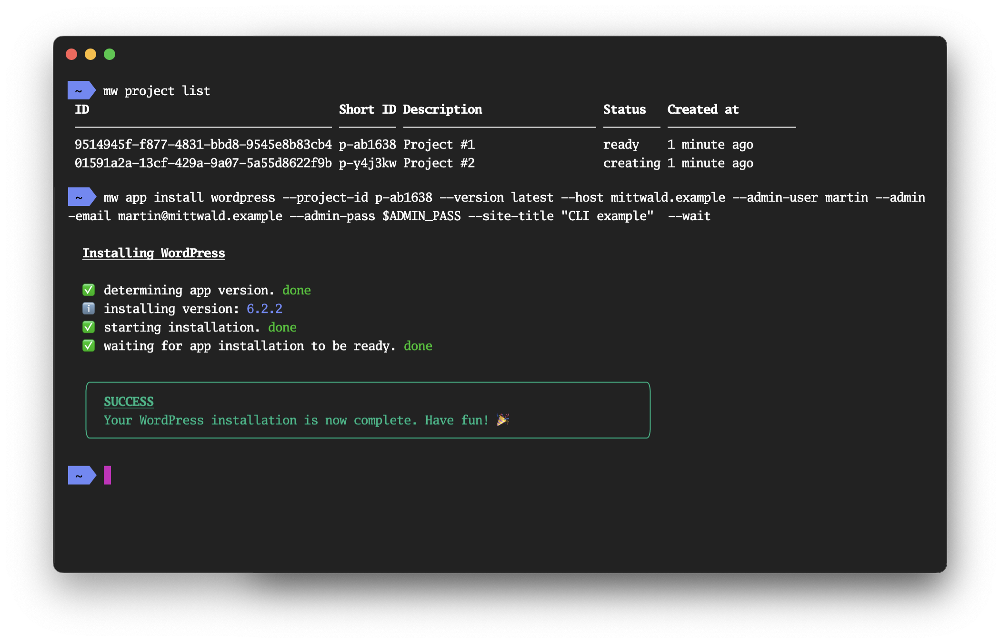

<center>

# `mw` &mdash; the mittwald command-line tool



</center>

> ⚠️ **EXPERIMENTAL &mdash; STABILITY NOTICE**
>
> This project is **experimental**, and we do not offer any stability guarantees
> of any kind for the command structure, input flags and arguments and output
> formats. We welcome you to give this project a try and we're looking forward
> for any feedback on this project in this stage of development. However, please
> do not rely on any inputs or outputs of this project to remain stable.

## Synposis

`mw` is the command-line tool for interacting with the mittwald mStudio v2 API.

## Getting started

### Installation

#### macOS, using Homebrew

Installation using [Homebrew](https://brew.sh/) is the recommended way of
installation on macOS.

```shell
$ brew tap mittwald/cli
$ brew install mw
```

#### Windows, using the Installer

Find the appropriate Windows installer from the
[releases page](https://github.com/mittwald/cli/releases) and run the installer.
After running the installer, you should be able to use the `mw` command on
either the CMD prompt or PowerShell.

#### Any OS, using Node.js+NPM

Installing the CLI via NPM will work on any OS; however we cannot guarantee
stability, because functionality of the CLI may depend on the Node.js runtime
already installed on your system. Also, the automatic upgrade will not work when
using NPM; remember to run `npm upgrade -g @mittwald/cli` occasionally.

```shell
$ npm install -g @mittwald/cli
```

#### Any OS, using Docker

There is also the
[`mittwald/cli` Docker image](https://hub.docker.com/r/mittwald/cli) that you
can use instead of installing the CLI on your system. In case of the Docker
container, authentication works a bit differently than described below: Make
sure that there is an environment variable `MITTWALD_API_TOKEN` present on your
system; you can then pass that environment variable into your container:

```shell
$ export MITTWALD_API_TOKEN=<enter token here>
$ docker run --rm -it -e MITTWALD_API_TOKEN mittwald/cli help
```

### Authentication

To use the CLI, you will need an
[mStudio API token](https://studio.mittwald.de/app/profile/api-tokens). With
your token in your clipboard, run the `mw login token` command:

```shell
$ mw login token
Enter your mStudio API token: ****************
token saved to '/Users/mhelmich/.config/mw/token'
```

### Setting up shell autocompletion

The `mw` CLI offers a lot of commands and flags, and it can be hard to remember
all of them. To make your life easier, the CLI offers autocompletion for the
Bash and ZSH shells. To enable autocompletion, run the following command:

```shell
$ mw autocomplete
```

After that, follow the instructions printed by that command (those are specific
to your shell -- Bash, ZSH and Powershell are supported).

## Contributing

If you are a developer (either at @mittwald or an external contributor) and want
to contribute to the CLI, please refer to the [CONTRIBUTING.md](CONTRIBUTING.md)
document.

## Usage

```sh-session
$ npm install -g @mittwald/cli
$ mw COMMAND
running command...
$ mw (--version)
@mittwald/cli/1.0.0 darwin-arm64 node-v18.11.0
$ mw --help [COMMAND]
USAGE
  $ mw COMMAND
...
```

## Commands

<!-- commands -->
* [`mw autocomplete [SHELL]`](#mw-autocomplete-shell)
* [`mw help [COMMAND]`](#mw-help-command)
* [`mw update [CHANNEL]`](#mw-update-channel)

## `mw autocomplete [SHELL]`

Display autocomplete installation instructions.

```
USAGE
  $ mw autocomplete [SHELL] [-r]

ARGUMENTS
  SHELL  (zsh|bash|powershell) Shell type

FLAGS
  -r, --refresh-cache  Refresh cache (ignores displaying instructions)

DESCRIPTION
  Display autocomplete installation instructions.

EXAMPLES
  $ mw autocomplete

  $ mw autocomplete bash

  $ mw autocomplete zsh

  $ mw autocomplete powershell

  $ mw autocomplete --refresh-cache
```

_See code: [@oclif/plugin-autocomplete](https://github.com/oclif/plugin-autocomplete/blob/v3.0.13/src/commands/autocomplete/index.ts)_

## `mw help [COMMAND]`

Display help for mw.

```
USAGE
  $ mw help [COMMAND...] [-n]

ARGUMENTS
  COMMAND...  Command to show help for.

FLAGS
  -n, --nested-commands  Include all nested commands in the output.

DESCRIPTION
  Display help for mw.
```

_See code: [@oclif/plugin-help](https://github.com/oclif/plugin-help/blob/v6.0.20/src/commands/help.ts)_

## `mw update [CHANNEL]`

update the mw CLI

```
USAGE
  $ mw update [CHANNEL] [-a] [--force] [-i | -v <value>]

FLAGS
  -a, --available        See available versions.
  -i, --interactive      Interactively select version to install. This is ignored if a channel is provided.
  -v, --version=<value>  Install a specific version.
      --force            Force a re-download of the requested version.

DESCRIPTION
  update the mw CLI

EXAMPLES
  Update to the stable channel:

    $ mw update stable

  Update to a specific version:

    $ mw update --version 1.0.0

  Interactively select version:

    $ mw update --interactive

  See available versions:

    $ mw update --available
```

_See code: [@oclif/plugin-update](https://github.com/oclif/plugin-update/blob/v4.2.4/src/commands/update.ts)_
<!-- commandsstop -->
